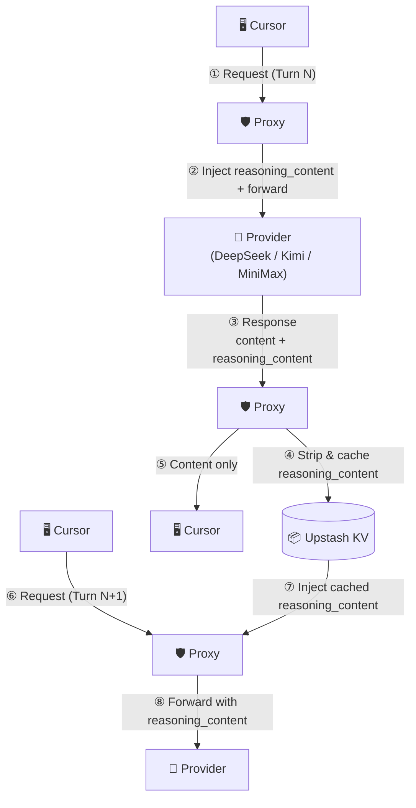
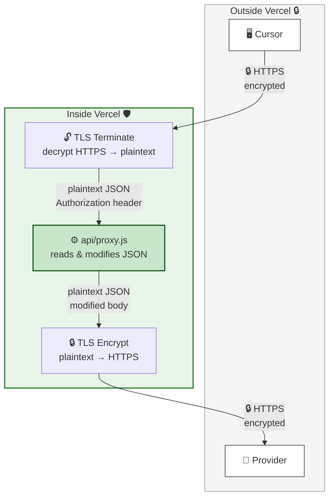

# cursorProxy — Multi-Provider Reasoning Proxy

A lightweight Vercel Edge Function that proxies requests to **DeepSeek**, **Kimi**, and **MiniMax** APIs. For reasoning models (DeepSeek, Kimi) it **caches `reasoning_content` by conversation position and injects it back into subsequent requests**, enabling seamless multi-turn reasoning in clients like Cursor that don't handle the field natively.

## Why

DeepSeek's and Kimi's reasoning models return a `reasoning_content` field alongside `content` in each response. On the next turn, the API **requires** you to pass that `reasoning_content` back inside the assistant message. If you don't, you get a 400 error:

```
{"error": {"message": "The reasoning_content in the thinking mode must be passed back to the API."}}
```

Clients like Cursor strip or ignore `reasoning_content`, so they never send it back. This proxy:

1. **Injects** cached `reasoning_content` into assistant messages before forwarding to the provider
2. **Strips** `reasoning_content` from responses before returning them to Cursor
3. **Caches** the `reasoning_content` keyed by conversation position (SHA256 of all messages *before* the assistant reply)

MiniMax models embed thinking as `<think>…</think>` tags inside `content` — Cursor passes this through naturally, so no injection is needed; the proxy is a clean pass-through for MiniMax reasoning.

## Why conversation-position hashing?

Cursor may send assistant message `content` as a structured array `[{"type":"text","text":"..."}]` instead of a plain string. A content-hash cache would never match. The conversation prefix (all messages before the assistant reply) is identical on both sides regardless of content format, so position-based hashing is robust.

---

## Prerequisites

Before deploying, make sure you have:

- A **[Vercel](https://vercel.com)** account (free tier is fine) — for Option A
- An **[Upstash](https://upstash.com)** account for Redis KV storage (free tier is fine) — required for Vercel, optional for Docker (local Redis is faster)
- API key(s) for the providers you want to use:
  - **DeepSeek**: [platform.deepseek.com](https://platform.deepseek.com) → API Keys
  - **Kimi**: [platform.moonshot.cn](https://platform.moonshot.cn) → API Keys
  - **MiniMax**: [platform.minimax.io](https://platform.minimax.io) → API Keys

---

## Step 1: Set Up Redis

The proxy uses Redis to cache `reasoning_content` between conversation turns.

**Option A (Vercel) — Upstash (required):**

1. Go to **[upstash.com](https://upstash.com)** and sign up for a free account.
2. In the Upstash Console, click **Create Database**.
3. Choose a name (e.g. `cursor-proxy`), select a region close to your Vercel deployment, and click **Create**.
4. On the database detail page, scroll to **REST API** and copy:
   - **REST URL** → this is your `KV_URL`
   - **Token** (the read-write token) → this is your `KV_TOKEN`

**Option B (Docker) — Local Redis (recommended):**

No external account needed. Add a Redis container to your compose stack and set `REDIS_URL=redis://redis:6379`. See the compose examples below. Upstash still works for Docker if you prefer a managed service.

---

## Step 2: Deploy

### Option A — Vercel (Edge, recommended)

The proxy runs as a **Vercel Edge Function** — zero cold starts, global distribution.

#### One-click deploy

[](https://vercel.com/new/clone?repository-url=https://github.com/lqdflying/cursorProxy)

#### Manual deploy

1. Fork or clone this repo.
2. Go to **[vercel.com/new](https://vercel.com/new)** and import the repository.
3. In the **Environment Variables** section, add the variables from the table below.
4. Click **Deploy**.

### Option B — Docker (self-hosted)

A Node.js HTTP server wraps the same proxy logic for self-hosted deployments. The same `api/proxy.js` is used — only the runtime adapter differs.

Since only the `latest` tag is published, always force-pull to get the newest image.

```bash
docker run -d --pull always -p 127.0.0.1:3000:3000 \
  -e KV_URL=<your-upstash-rest-url> \
  -e KV_TOKEN=<your-upstash-token> \
  lqdflying/cursorproxy:latest
```

#### Standard Docker Compose (with local Redis)

```yaml
services:
  redis:
    image: redis:7-alpine
    restart: unless-stopped

  proxy:
    image: lqdflying/cursorproxy:latest
    pull_policy: always
    ports:
      - "127.0.0.1:3000:3000"
    environment:
      REDIS_URL: "redis://redis:6379"
      # DEBUG: "true"
    depends_on:
      - redis
    restart: unless-stopped
```

> To use Upstash instead of local Redis, replace `REDIS_URL` with `KV_URL` + `KV_TOKEN`.

#### 1Panel server

1Panel creates a shared Docker network called `1panel-network`. Add your container to it so 1Panel's built-in OpenResty/Nginx can reach the proxy by container name without exposing the port publicly.

```yaml
services:
  redis:
    image: redis:7-alpine
    restart: unless-stopped
    networks:
      - 1panel-network

  proxy:
    image: lqdflying/cursorproxy:latest
    pull_policy: always
    ports:
      - "127.0.0.1:3000:3000"
    environment:
      REDIS_URL: "redis://redis:6379"
      # DEBUG: "true"
    depends_on:
      - redis
    restart: unless-stopped
    networks:
      - 1panel-network

networks:
  1panel-network:
    external: true
```

Then in **1Panel → Website → Reverse Proxy**, set the upstream to `http://proxy:3000` (container name) or `http://127.0.0.1:3000`. Enable **streaming** / disable buffering in the proxy settings so SSE responses are not buffered.

The Docker image is automatically built and pushed to [hub.docker.com/r/lqdflying/cursorproxy](https://hub.docker.com/r/lqdflying/cursorproxy) on every commit via GitHub Actions (`linux/amd64` + `linux/arm64`).

#### With Nginx reverse proxy

```nginx
server {
    listen 443 ssl;
    server_name proxy.example.com;

    ssl_certificate     /etc/ssl/certs/proxy.example.com.crt;
    ssl_certificate_key /etc/ssl/private/proxy.example.com.key;

    location / {
        proxy_pass         http://127.0.0.1:3000;
        proxy_http_version 1.1;
        proxy_set_header   Host              $host;
        proxy_set_header   X-Real-IP         $remote_addr;
        proxy_set_header   X-Forwarded-For   $proxy_add_x_forwarded_for;
        proxy_set_header   X-Forwarded-Proto $scheme;
        proxy_set_header   X-Forwarded-Host  $host;

        # Required for streaming (SSE)
        proxy_buffering    off;
        proxy_cache        off;
        chunked_transfer_encoding on;

        proxy_read_timeout 60s;
        proxy_send_timeout 60s;
    }
}

# Redirect HTTP to HTTPS
server {
    listen 80;
    server_name proxy.example.com;
    return 301 https://$host$request_uri;
}
```

Or with Docker Compose including Nginx:

```yaml
services:
  proxy:
    image: lqdflying/cursorproxy:latest
    pull_policy: always
    environment:
      KV_URL: <your-upstash-rest-url>
      KV_TOKEN: <your-upstash-token>
    restart: unless-stopped

  nginx:
    image: nginx:alpine
    ports:
      - "80:80"
      - "443:443"
    volumes:
      - ./nginx.conf:/etc/nginx/conf.d/default.conf:ro
      - ./certs:/etc/ssl:ro
    depends_on:
      - proxy
    restart: unless-stopped
```

### Environment Variables

| Variable | Required | Default | Description |
|---|---|---|---|
| `REDIS_URL` | Docker: recommended | — | Local Redis URL e.g. `redis://redis:6379` — takes priority over Upstash |
| `KV_URL` | Vercel: **Yes** | — | Upstash Redis REST URL |
| `KV_TOKEN` | Vercel: **Yes** | — | Upstash Redis read-write token |
| `UPSTREAM_DEEPSEEK` | No | `https://api.deepseek.com` | Override DeepSeek upstream base URL |
| `UPSTREAM_KIMI` | No | `https://api.moonshot.ai` | Override Kimi upstream base URL |
| `UPSTREAM_MINIMAX` | No | `https://api.minimax.io` | Override MiniMax upstream base URL |
| `DEBUG` | No | `false` | Set to `"true"` to enable verbose logs |
| `PORT` | No | `3000` | HTTP port (Docker only) |

> **Note:** If neither `REDIS_URL` nor `KV_URL`+`KV_TOKEN` are set, the proxy still works but `reasoning_content` caching is disabled (multi-turn reasoning will fail on DeepSeek/Kimi).

---

## Step 3: Configure Cursor (or any OpenAI-compatible client)

Your provider API key is forwarded directly from your client via the `Authorization` header and is never stored by the proxy.

| Provider | Base URL | Example models |
|---|---|---|
| **DeepSeek** | `https://<your-vercel-domain>/deepseek/v1` | `deepseek-reasoner`, `deepseek-chat` |
| **Kimi** | `https://<your-vercel-domain>/kimi/v1` | `kimi-k2.6`, `kimi-k2-thinking` |
| **MiniMax** | `https://<your-vercel-domain>/minimax/v1` | `MiniMax-M2.7`, `MiniMax-M2.5` |
| **DeepSeek (legacy)** | `https://<your-vercel-domain>/v1` | same as DeepSeek above |

In Cursor → **Settings → Models → Add Custom Model**:

| Field | Value |
|---|---|
| Base URL | e.g. `https://<your-vercel-domain>/deepseek/v1` |
| API Key | Your provider API key |
| Model | e.g. `deepseek-reasoner` |

---

## How It Works

### Request / response flow



Turn N → proxy strips and caches `reasoning_content`.  
Turn N+1 → proxy injects it back so the provider can continue the reasoning chain.

> MiniMax models embed thinking as `<think>` tags in `content` — Cursor preserves this naturally, so the proxy passes MiniMax responses straight through without any injection.

### TLS / encryption flow



- **Two independent TLS connections** — no plaintext ever travels the public internet.
- Vercel's edge infrastructure handles TLS termination (decrypt) and re-encryption (encrypt) around the Edge Function.
- The proxy sees the request/response body in plaintext **only inside Vercel's sandbox** (required to modify the JSON).
- Your provider API key stays in the `Authorization` header — never in URLs, never logged.

---

## Additional Notes

- Supports both streaming (`text/event-stream`) and non-streaming responses.
- Caches `reasoning_content` even when the stream ends without an explicit `[DONE]` frame.
- Built on the [Vercel Edge Runtime](https://vercel.com/docs/functions/edge-functions) — no cold-start penalty (Vercel deployment).
- The legacy `/v1/` path is kept as a backward-compatible DeepSeek alias.

## Files

```
api/proxy.js                    Core proxy logic (shared by both deployments)
server.js                       Node.js HTTP adapter (Docker / self-hosted)
Dockerfile                      Docker image definition
.github/workflows/docker.yml    CI — build & push to DockerHub on every commit
vercel.json                     Vercel path rewrites
package.json                    Package descriptor
```

## License

MIT

