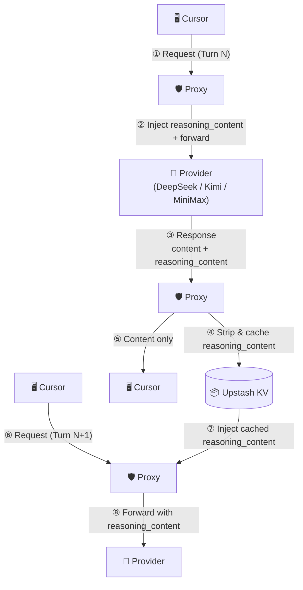
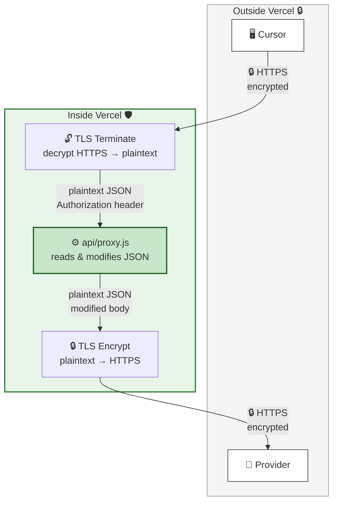

# cursorProxy — Multi-Provider Reasoning Proxy

A lightweight Vercel Edge Function that proxies requests to **DeepSeek**, **Kimi**, and **MiniMax** APIs. For reasoning models (DeepSeek, Kimi) it **caches `reasoning_content` by conversation position and injects it back into subsequent requests**, enabling seamless multi-turn reasoning in clients like Cursor that don't handle the field natively.

## Why

DeepSeek's and Kimi's reasoning models return a `reasoning_content` field alongside `content` in each response. On the next turn, the API **requires** you to pass that `reasoning_content` back inside the assistant message. If you don't, you get a 400 error:

```
{"error": {"message": "The reasoning_content in the thinking mode must be passed back to the API."}}
```

Clients like Cursor strip or ignore `reasoning_content`, so they never send it back. This proxy:

1. **Injects** cached `reasoning_content` into assistant messages before forwarding to the provider
2. **Strips** `reasoning_content` from responses before returning them to Cursor
3. **Caches** the `reasoning_content` keyed by conversation position (SHA256 of all messages *before* the assistant reply)

MiniMax models embed thinking as `<think>…</think>` tags inside `content` — Cursor passes this through naturally, so no injection is needed; the proxy is a clean pass-through for MiniMax reasoning.

## Why conversation-position hashing?

Cursor may send assistant message `content` as a structured array `[{"type":"text","text":"..."}]` instead of a plain string. A content-hash cache would never match. The conversation prefix (all messages before the assistant reply) is identical on both sides regardless of content format, so position-based hashing is robust.

---

## Prerequisites

Before deploying, make sure you have:

- A **[Vercel](https://vercel.com)** account (free tier is fine)
- An **[Upstash](https://upstash.com)** account for Redis KV storage (free tier is fine)
- API key(s) for the providers you want to use:
  - **DeepSeek**: [platform.deepseek.com](https://platform.deepseek.com) → API Keys
  - **Kimi**: [platform.kimi.com](https://platform.kimi.com) → API Keys
  - **MiniMax**: [platform.minimax.io](https://platform.minimax.io) → API Keys

---

## Step 1: Register Upstash and Create a Redis Database

The proxy uses Upstash Redis to cache `reasoning_content` between conversation turns.

1. Go to **[upstash.com](https://upstash.com)** and sign up for a free account.
2. In the Upstash Console, click **Create Database**.
3. Choose a name (e.g. `cursor-proxy`), select a region close to your Vercel deployment, and click **Create**.
4. On the database detail page, scroll to **REST API** and copy:
   - **REST URL** → this is your `KV_URL`
   - **Token** (the read-write token) → this is your `KV_TOKEN`

Keep these two values — you'll paste them into Vercel in the next step.

---

## Step 2: Deploy

### Option A — Vercel (Edge, recommended)

The proxy runs as a **Vercel Edge Function** — zero cold starts, global distribution.

#### One-click deploy

[](https://vercel.com/new/clone?repository-url=https://github.com/lqdflying/cursorProxy)

#### Manual deploy

1. Fork or clone this repo.
2. Go to **[vercel.com/new](https://vercel.com/new)** and import the repository.
3. In the **Environment Variables** section, add the variables from the table below.
4. Click **Deploy**.

### Option B — Docker (self-hosted)

A Node.js HTTP server wraps the same proxy logic for self-hosted deployments. The same `api/proxy.js` is used — only the runtime adapter differs.

```bash
docker run -d -p 3000:3000 \
  -e KV_URL=<your-upstash-rest-url> \
  -e KV_TOKEN=<your-upstash-token> \
  lqdflying/cursorproxy:latest
```

Or with Docker Compose:

```yaml
services:
  proxy:
    image: lqdflying/cursorproxy:latest
    ports:
      - "3000:3000"
    environment:
      KV_URL: <your-upstash-rest-url>
      KV_TOKEN: <your-upstash-token>
      # DEBUG: "true"
    restart: unless-stopped
```

The Docker image is automatically built and pushed to [hub.docker.com/r/lqdflying/cursorproxy](https://hub.docker.com/r/lqdflying/cursorproxy) on every commit via GitHub Actions (`linux/amd64` + `linux/arm64`).

### Environment Variables

| Variable | Required | Default | Description |
|---|---|---|---|
| `KV_URL` | **Yes** | — | Upstash Redis REST URL (from Step 1) |
| `KV_TOKEN` | **Yes** | — | Upstash Redis read-write token (from Step 1) |
| `UPSTREAM_DEEPSEEK` | No | `https://api.deepseek.com` | Override DeepSeek upstream base URL |
| `UPSTREAM_KIMI` | No | `https://api.moonshot.ai` | Override Kimi upstream base URL |
| `UPSTREAM_MINIMAX` | No | `https://api.minimax.io` | Override MiniMax upstream base URL |
| `DEBUG` | No | `false` | Set to `"true"` to enable verbose logs |
| `PORT` | No | `3000` | HTTP port (Docker only) |

> **Note:** `KV_URL` and `KV_TOKEN` are the only required variables. Without them the proxy still works but `reasoning_content` caching is disabled (multi-turn reasoning will fail on DeepSeek/Kimi).

---

## Step 3: Configure Cursor (or any OpenAI-compatible client)

Your provider API key stays in your client — the proxy forwards the `Authorization` header directly, never storing it.

| Provider | Base URL | Example models |
|---|---|---|
| **DeepSeek** | `https://<your-vercel-domain>/deepseek/v1` | `deepseek-reasoner`, `deepseek-chat` |
| **Kimi** | `https://<your-vercel-domain>/kimi/v1` | `kimi-k2.6`, `kimi-k2-thinking` |
| **MiniMax** | `https://<your-vercel-domain>/minimax/v1` | `MiniMax-M2.7`, `MiniMax-M2.5` |
| **DeepSeek (legacy)** | `https://<your-vercel-domain>/v1` | same as DeepSeek above |

In Cursor → **Settings → Models → Add Custom Model**:

| Field | Value |
|---|---|
| Base URL | e.g. `https://<your-vercel-domain>/deepseek/v1` |
| API Key | Your provider API key |
| Model | e.g. `deepseek-reasoner` |

---

## How It Works

### Request / response flow



Turn N → proxy strips and caches `reasoning_content`.  
Turn N+1 → proxy injects it back so the provider can continue the reasoning chain.

> MiniMax models embed thinking as `<think>` tags in `content` — Cursor preserves this naturally, so the proxy passes MiniMax responses straight through without any injection.

### TLS / encryption flow



- **Two independent TLS connections** — no plaintext ever travels the public internet.
- Vercel's edge infrastructure handles TLS termination (decrypt) and re-encryption (encrypt) around the Edge Function.
- The proxy sees the request/response body in plaintext **only inside Vercel's sandbox** (required to modify the JSON).
- Your provider API key stays in the `Authorization` header — never in URLs, never logged.

---

## Additional Notes

- Supports both streaming (`text/event-stream`) and non-streaming responses.
- Caches `reasoning_content` even when the stream ends without an explicit `[DONE]` frame.
- Built on the [Vercel Edge Runtime](https://vercel.com/docs/functions/edge-functions) — no cold-start penalty (Vercel deployment).
- The legacy `/v1/` path is kept as a backward-compatible DeepSeek alias.

## Files

```
api/proxy.js                    Core proxy logic (shared by both deployments)
server.js                       Node.js HTTP adapter (Docker / self-hosted)
Dockerfile                      Docker image definition
.github/workflows/docker.yml    CI — build & push to DockerHub on every commit
vercel.json                     Vercel path rewrites
package.json                    Package descriptor
```

## License

MIT

