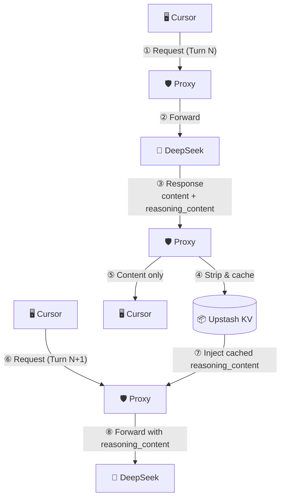
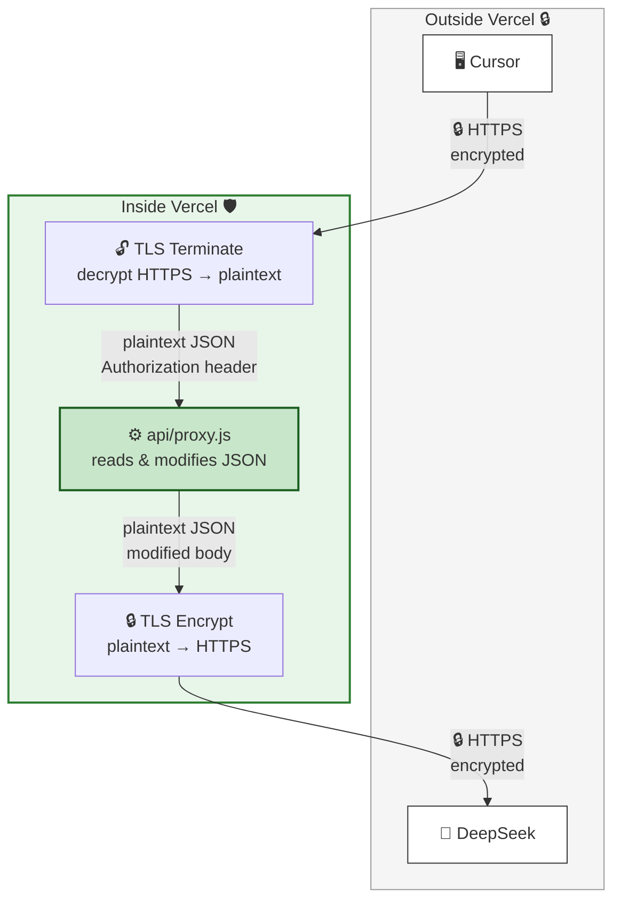

# DeepSeek Reasoning Proxy

A lightweight Vercel Edge Function that proxies requests to the DeepSeek API. It **caches `reasoning_content` by conversation position and injects it back into subsequent requests**, enabling multi-turn conversations with `deepseek-reasoner` in clients like Cursor that don't handle the field natively.

## Why

DeepSeek's reasoning models (`deepseek-reasoner`) return a `reasoning_content` field alongside `content` in each response. On the next turn, the API **requires** you to pass that `reasoning_content` back inside the assistant message. If you don't, you get a 400 error:

```
{"error": {"message": "The reasoning_content in the thinking mode must be passed back to the API."}}
```

Clients like Cursor strip or ignore `reasoning_content`, so they never send it back. This proxy:

1. **Removes** `reasoning_content` from responses before returning them to Cursor (so Cursor doesn't choke on it)
2. **Caches** the `reasoning_content` keyed by conversation position (SHA256 of all messages *before* the assistant reply)
3. **Injects** the cached `reasoning_content` into *all* assistant messages in the request before forwarding to DeepSeek

## Why conversation-position hashing?

Cursor may send assistant message `content` as a structured array `[{"type":"text","text":"..."}]` instead of a plain string. A content-hash cache would never match. The conversation prefix (all messages before the assistant reply) is identical on both sides regardless of content format, so position-based hashing is robust.

## Deploy

[](https://vercel.com/new/clone?repository-url=https://github.com/lqdflying/cursorProxy)

Or manually:

1. Fork / clone this repo
2. Import into [Vercel](https://vercel.com)
3. Add environment variables in Vercel:
   - `KV_URL` — your Upstash Redis REST URL
   - `KV_TOKEN` — your Upstash Redis REST token
4. Deploy

## Usage

Keep your DeepSeek API key in **Cursor** (or whatever client you use). The proxy forwards it directly to DeepSeek — no keys are stored on Vercel.

Configure your client to point at the Vercel deployment:

| Field | Value |
|---|---|
| Base URL | `https://<your-vercel-domain>/v1` |
| API Key | Your DeepSeek API key (`sk-...`) |
| Model | `deepseek-reasoner` or `deepseek-chat` |

## How It Works

### Request / response flow



Turn N → proxy strips and caches `reasoning_content`.  
Turn N+1 → proxy injects it back so DeepSeek can continue the reasoning chain.

### TLS / encryption flow



- **Two independent TLS connections** — no plaintext ever travels the public internet.
- Vercel's edge infrastructure handles TLS termination (decrypt) and re-encryption (encrypt) around the Edge Function.
- The proxy sees the request/response body in plaintext **only inside Vercel's sandbox** (required to modify the JSON).
- Your DeepSeek API key stays in the `Authorization` header — never in URLs, never logged.

- Two independent TLS connections. No plaintext ever travels the public internet.
- The proxy sees the request/response body in plaintext **only inside Vercel's sandbox** (required to modify the JSON).
- Your DeepSeek API key stays in the `Authorization` header — never in URLs, never logged.
- Supports both streaming (`text/event-stream`) and non-streaming responses
- Caches `reasoning_content` even when the stream ends without an explicit `[DONE]` line
- Built on the [Vercel Edge Runtime](https://vercel.com/docs/functions/edge-functions) — no cold start penalty

## Files

```
api/proxy.js    Edge Function — core proxy logic
vercel.json     Rewrites /v1/* to /api/proxy
package.json    Minimal package descriptor
```

## License

MIT
