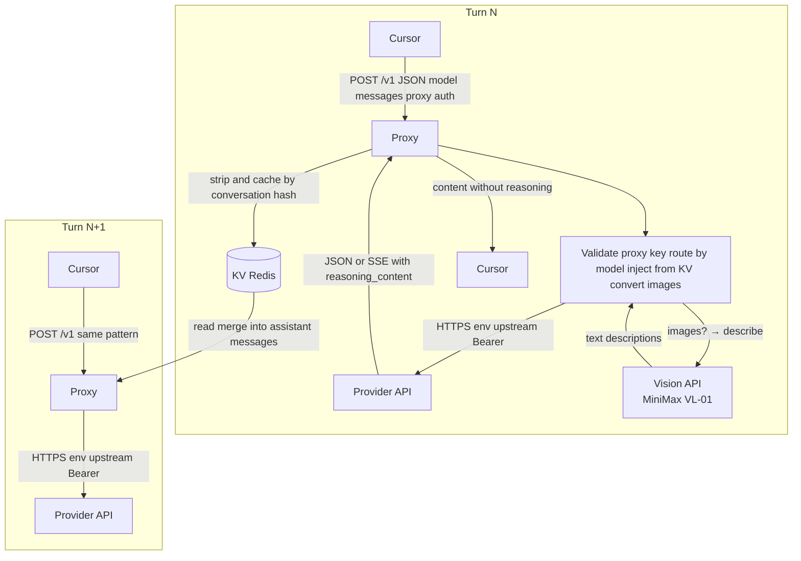
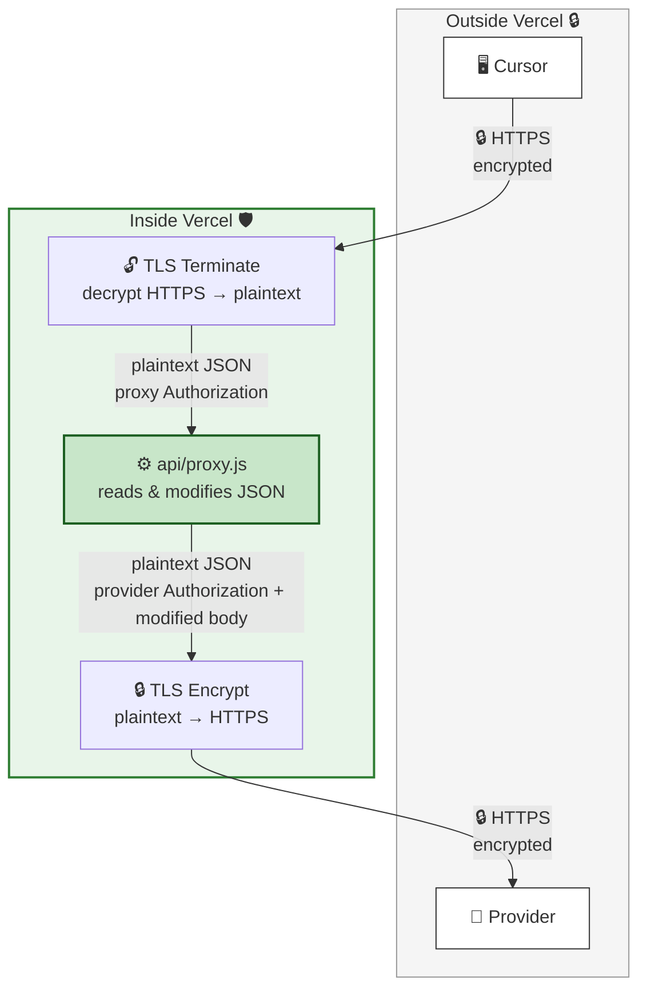

# cursorProxy — Multi-Provider Reasoning & Vision Proxy

A lightweight Vercel Edge Function that proxies requests to **DeepSeek**, **Kimi**, and **MiniMax** APIs.

**Reasoning bridge:** For DeepSeek and Kimi, it **caches `reasoning_content` by conversation position and injects it back into subsequent requests**, enabling seamless multi-turn reasoning in clients like Cursor that don't handle the field natively.

**Vision bridge:** When you paste screenshots into Cursor chat, DeepSeek and MiniMax chat APIs reject inline images. The proxy **automatically converts images to text descriptions** via a vision API (MiniMax VL-01 by default) and injects the descriptions into the message before forwarding. No more "this model does not support vision" errors.

**Upgrade note:** The default entry is now **`/v1`** with **model-based upstream routing** and **server-side provider keys**. Cursor should use **`CURSORPROXY_API_KEY`** as the API key field; legacy path prefixes (`/deepseek/v1`, etc.) remain supported.

## Why

DeepSeek's and Kimi's reasoning models return a `reasoning_content` field alongside `content` in each response. On the next turn, the API **requires** you to pass that `reasoning_content` back inside the assistant message. If you don't, you get a 400 error:

```
{"error": {"message": "The reasoning_content in the thinking mode must be passed back to the API."}}
```

Clients like Cursor strip or ignore `reasoning_content`, so they never send it back. This proxy:

1. **Injects** cached `reasoning_content` into assistant messages before forwarding to the provider
2. **Strips** `reasoning_content` from responses before returning them to Cursor
3. **Caches** the `reasoning_content` keyed by conversation position (SHA256 of all messages *before* the assistant reply)

MiniMax models embed thinking as `<think>…</think>` tags inside `content` — Cursor passes this through naturally, so no injection is needed; the proxy is a clean pass-through for MiniMax reasoning.

## Vision Bridge (new)

DeepSeek and MiniMax **chat completion APIs do not accept inline images**. When you paste a screenshot in Cursor, it is sent as a base64 `image_url` in the message content — these models cannot process it.

The proxy solves this by:

1. **Detecting** `image_url` content blocks in incoming messages
2. **Calling** a vision API to describe each image (MiniMax VL-01 by default)
3. **Replacing** the `image_url` with a text description before forwarding to the text model

**Example:**

```
Before (what the text model received):
  [text: "What does this show?"]
  [image_url: data:image/png;base64,...]

After (what it receives now):
  [text: "What does this show?"]
  [text: "[Image content: A solid yellow square with no patterns...]"]
```

### Vision API setup (required for image support)

> [!IMPORTANT]
> You **must** configure a vision API backend to use screenshots/images in Cursor chat. If no vision backend is configured and you paste an image, the proxy will still run but image descriptions will fail and be replaced with an error placeholder.

Choose one:

**Option A — MiniMax VL-01 (default, recommended):**
- Uses your existing **`MINIMAX_API_KEY`** — no extra account needed
- Set `VISION_API_PROVIDER=minimax_vl` (or leave it unset; this is the default)
- MiniMax Coding Plan key (`sk-cp-*`) works with this endpoint

**Option B — OpenAI Vision:**
- Requires a separate **`OPENAI_API_KEY`**
- Set `VISION_API_PROVIDER=openai` and `VISION_API_KEY=sk-...`
- Supports any OpenAI-compatible vision endpoint via `VISION_API_URL`

> [!NOTE]
> **Kimi is left untouched** — it supports vision natively, so images pass through directly without conversion.

## Why conversation-position hashing?

Cursor may send assistant message `content` as a structured array `[{"type":"text","text":"..."}]` instead of a plain string. A content-hash cache would never match. The conversation prefix (all messages before the assistant reply) is identical on both sides regardless of content format, so position-based hashing is robust.

---

## Prerequisites

Before deploying, make sure you have:

- A **[Vercel](https://vercel.com)** account (free tier is fine) — for Option A
- An **[Upstash](https://upstash.com)** account for Redis KV storage (free tier is fine) — required for Vercel, optional for Docker (local Redis is faster)
- A **proxy API key** you generate yourself (`CURSORPROXY_API_KEY`) — Cursor sends this on every request; it is not an upstream provider key. Generate a random secret (see below) and set the same value in Vercel / `.env` and in Cursor’s API key field.
- **Upstream API keys** stored only on the server (`DEEPSEEK_API_KEY`, `KIMI_API_KEY`, `MINIMAX_API_KEY`):
  - **DeepSeek**: [platform.deepseek.com](https://platform.deepseek.com) → API Keys
  - **Kimi**: [platform.moonshot.ai](https://platform.moonshot.ai) → [API Keys](https://platform.moonshot.ai/console/api-keys) (set `UPSTREAM_KIMI=https://api.moonshot.cn` if your account uses the China API endpoint)
  - **MiniMax**: [platform.minimax.io](https://platform.minimax.io) → API Keys
- **Vision API** (required if you want to paste screenshots/images in Cursor chat):
  - **MiniMax VL-01** (default): reuses `MINIMAX_API_KEY` — no extra key needed
  - **OpenAI Vision**: requires a separate `OPENAI_API_KEY` (set `VISION_API_PROVIDER=openai`)

> [!TIP]
> The fastest way to get image support is to use **MiniMax VL-01** — it uses the same `MINIMAX_API_KEY` you already have. No extra signup or billing setup required.

---

## Step 1: Set Up Redis

The proxy uses Redis to cache `reasoning_content` between conversation turns.

**Option A (Vercel) — Upstash (required):**

1. Go to **[upstash.com](https://upstash.com)** and sign up for a free account.
2. In the Upstash Console, click **Create Database**.
3. Choose a name (e.g. `cursor-proxy`), select a region close to your Vercel deployment, and click **Create**.
4. On the database detail page, scroll to **REST API** and copy:
   - **REST URL** → this is your `KV_URL`
   - **Token** (the read-write token) → this is your `KV_TOKEN`

**Option B (Docker) — Local Redis (recommended):**

No external account needed. Add a Redis container to your compose stack and set `REDIS_URL=redis://redis:6379`. See the compose examples below. Upstash still works for Docker if you prefer a managed service.

---

## Step 2: Deploy

### Option A — Vercel (Edge, recommended)

The proxy runs as a **Vercel Edge Function** — zero cold starts, global distribution.

#### One-click deploy

[](https://vercel.com/new/clone?repository-url=https://github.com/lqdflying/cursorProxy)

#### Manual deploy

1. Fork or clone this repo.
2. Go to **[vercel.com/new](https://vercel.com/new)** and import the repository.
3. In the **Environment Variables** section, add the variables from the table below.
4. Click **Deploy**.

### Option B — Docker (self-hosted)

A Node.js HTTP server wraps the same proxy logic for self-hosted deployments. The same `api/proxy.js` is used — only the runtime adapter differs.

Since only the `latest` tag is published, always force-pull to get the newest image.

Copy [`.env.example`](.env.example) to **`.env`**, fill in secrets and Redis/KV settings, then:

```bash
docker run -d --pull always -p 127.0.0.1:3000:3000 --env-file .env lqdflying/cursorproxy:latest
```

Do **not** commit `.env`; keep keys only on the server or in your secrets manager.

#### Standard Docker Compose (with local Redis)

Put all secrets and `REDIS_URL` in a **`.env`** file next to the compose file (see [`.env.example`](.env.example)). For Redis in Compose, use `REDIS_URL=redis://redis:6379` in `.env`.

```yaml
services:
  redis:
    image: redis:7-alpine
    restart: unless-stopped

  proxy:
    image: lqdflying/cursorproxy:latest
    pull_policy: always
    ports:
      - "127.0.0.1:3000:3000"
    env_file:
      - .env
    depends_on:
      - redis
    restart: unless-stopped
```

> To use Upstash instead of local Redis, set `KV_URL` and `KV_TOKEN` in `.env` and remove `REDIS_URL` (or leave Redis out of the stack).

#### 1Panel server

1Panel creates a shared Docker network called `1panel-network`. Add your container to it so 1Panel's built-in OpenResty/Nginx can reach the proxy by container name without exposing the port publicly.

```yaml
services:
  redis:
    image: redis:7-alpine
    restart: unless-stopped
    networks:
      - 1panel-network

  proxy:
    image: lqdflying/cursorproxy:latest
    pull_policy: always
    ports:
      - "127.0.0.1:3000:3000"
    env_file:
      - .env
    depends_on:
      - redis
    restart: unless-stopped
    networks:
      - 1panel-network

networks:
  1panel-network:
    external: true
```

Then in **1Panel → Website → Reverse Proxy**, set the upstream to `http://proxy:3000` (container name) or `http://127.0.0.1:3000`. Enable **streaming** / disable buffering in the proxy settings so SSE responses are not buffered.

The Docker image is automatically built and pushed to [hub.docker.com/r/lqdflying/cursorproxy](https://hub.docker.com/r/lqdflying/cursorproxy) on every commit via GitHub Actions (`linux/amd64` + `linux/arm64`).

#### With Nginx reverse proxy

```nginx
server {
    listen 443 ssl;
    server_name proxy.example.com;

    ssl_certificate     /etc/ssl/certs/proxy.example.com.crt;
    ssl_certificate_key /etc/ssl/private/proxy.example.com.key;

    location / {
        proxy_pass         http://127.0.0.1:3000;
        proxy_http_version 1.1;
        proxy_set_header   Host              $host;
        proxy_set_header   X-Real-IP         $remote_addr;
        proxy_set_header   X-Forwarded-For   $proxy_add_x_forwarded_for;
        proxy_set_header   X-Forwarded-Proto $scheme;
        proxy_set_header   X-Forwarded-Host  $host;

        # Required for streaming (SSE)
        proxy_buffering    off;
        proxy_cache        off;
        chunked_transfer_encoding on;

        proxy_read_timeout 60s;
        proxy_send_timeout 60s;
    }
}

# Redirect HTTP to HTTPS
server {
    listen 80;
    server_name proxy.example.com;
    return 301 https://$host$request_uri;
}
```

Or with Docker Compose including Nginx:

```yaml
services:
  proxy:
    image: lqdflying/cursorproxy:latest
    pull_policy: always
    env_file:
      - .env
    restart: unless-stopped

  nginx:
    image: nginx:alpine
    ports:
      - "80:80"
      - "443:443"
    volumes:
      - ./nginx.conf:/etc/nginx/conf.d/default.conf:ro
      - ./certs:/etc/ssl:ro
    depends_on:
      - proxy
    restart: unless-stopped
```

### Environment Variables

| Variable | Required | Default | Description |
|---|---|---|---|
| `CURSORPROXY_API_KEY` | **Recommended** (required for production) | — | Secret the client sends as `Authorization: Bearer …` or `x-api-key`. If unset, the proxy does **not** authenticate clients (local dev only). |
| `DEEPSEEK_API_KEY` | Yes, when routing to DeepSeek | — | Upstream DeepSeek API key (server-side only) |
| `KIMI_API_KEY` | Yes, when routing to Kimi | — | Upstream Kimi API key |
| `MINIMAX_API_KEY` | Yes, when routing to MiniMax | — | Upstream MiniMax API key |
| `REDIS_URL` | Docker: recommended | — | Local Redis URL e.g. `redis://redis:6379` — takes priority over Upstash |
| `KV_URL` | Vercel: **Yes** | — | Upstash Redis REST URL |
| `KV_TOKEN` | Vercel: **Yes** | — | Upstash Redis read-write token |
| `UPSTREAM_DEEPSEEK` | No | `https://api.deepseek.com` | Override DeepSeek upstream base URL |
| `UPSTREAM_KIMI` | No | `https://api.moonshot.ai` | Override Kimi upstream base URL |
| `UPSTREAM_MINIMAX` | No | `https://api.minimax.io` | Override MiniMax upstream base URL |
| `VISION_API_PROVIDER` | No | `minimax_vl` | Vision backend: `minimax_vl` (default, uses `MINIMAX_API_KEY`) or `openai` (requires `VISION_API_KEY`) |
| `VISION_API_URL` | No | `https://api.minimax.io/v1/coding_plan/vlm` | Override vision API endpoint |
| `VISION_MODEL` | No | `MiniMax-VL-01` | Vision model name (MiniMax VL-01 or `gpt-4o-mini` for OpenAI) |
| `VISION_API_KEY` | Only if `VISION_API_PROVIDER=openai` | — | OpenAI API key for vision (not needed for MiniMax VL-01) |

> [!IMPORTANT]
> `VISION_API_KEY` is **only required when using OpenAI Vision**. If you use the default `minimax_vl` provider, the proxy automatically reuses your `MINIMAX_API_KEY` — no extra key needed.
| `DEBUG` | No | `false` | Set to `"true"` to enable verbose logs |
| `PORT` | No | `3000` | HTTP port (Docker only) |

#### Generating `CURSORPROXY_API_KEY`

Use any long random string (treat it like a password). On Linux or macOS with OpenSSL:

```bash
openssl rand -hex 32
```

Copy the output into your deployment env and into Cursor (no spaces or newlines). Alternative:

```bash
openssl rand -base64 32 | tr -d '\n'
```

> **Note:** If neither `REDIS_URL` nor `KV_URL`+`KV_TOKEN` are set, the proxy still works but `reasoning_content` caching is disabled (multi-turn reasoning will fail on DeepSeek/Kimi).

**Routing:** For the unified base URL `https://<host>/v1`, the upstream provider is chosen from the JSON `model` field (`deepseek…`, `kimi…`, `minimax…` / `MiniMax…`, case-insensitive for the prefix). Requests without a model (for example `GET /v1/models`) default to **DeepSeek** unless you append `?provider=kimi` or `?provider=minimax`.

---

## Step 3: Configure Cursor (or any OpenAI-compatible client)

Use **one** OpenAI-compatible base URL. Cursor sends **`CURSORPROXY_API_KEY`** (never the upstream provider keys). The proxy picks the upstream from the **model** name and adds the correct provider `Authorization` header server-side.

| Mode | Base URL | How provider is chosen |
|---|---|---|
| **Unified (recommended)** | `https://<your-host>/v1` | From `model`: `deepseek*`, `kimi*`, `minimax*` / `MiniMax*` |
| **Legacy path override** | `https://<your-host>/deepseek/v1`, `/kimi/v1`, `/minimax/v1` | Upstream provider is fixed by the path segment only. **Authentication is unchanged:** if `CURSORPROXY_API_KEY` is set, Cursor must still send it on every request (legacy URLs do **not** skip the proxy key). |

When `CURSORPROXY_API_KEY` is unset (local dev only), no client secret is required for any path, unified or legacy.

Example models (unified URL):

| Provider | Example `model` values |
|---|---|
| DeepSeek | **`deepseek-v4-pro`**, **`deepseek-v4-flash`** ([official V4 IDs](https://api-docs.deepseek.com/news/news260424)) |
| Kimi | `kimi-k2.6`, `kimi-k2-thinking` |
| MiniMax | `MiniMax-M2.7`, `MiniMax-M2.5` |

In Cursor → **Settings → Models → Add Custom Model**:

| Field | Value |
|---|---|
| Base URL | `https://<your-host>/v1` |
| API Key | Your **`CURSORPROXY_API_KEY`** value |
| Model | e.g. **`deepseek-v4-pro`** or `kimi-k2.6` |

**Auth:** Send the proxy secret as `Authorization: Bearer <CURSORPROXY_API_KEY>` (Cursor’s default) or as the `x-api-key` header.

---

## How It Works

### Request / response flow

Single base URL **`/v1`**: each chat request carries a **`model`** (for example `deepseek-v4-pro`). The proxy validates **`CURSORPROXY_API_KEY`**, maps the model prefix to DeepSeek / Kimi / MiniMax, merges any cached `reasoning_content` into assistant messages, **converts images to text descriptions** (for DeepSeek and MiniMax), and calls the upstream with **`DEEPSEEK_API_KEY` / `KIMI_API_KEY` / `MINIMAX_API_KEY`** from the environment (never from Cursor).



**Turn N:** Cursor sends the proxy secret and model. The proxy checks the client, resolves the host from the model string, injects prior-turn reasoning from KV when present, forwards with the server-side provider key, then strips `reasoning_content` from the response and writes it to KV.

**Turn N+1:** The proxy reads KV and injects stored `reasoning_content` into the right assistant slots before calling the provider again so DeepSeek / Kimi receive the full chain they expect. MiniMax thinking stays in `content` as tags, so KV injection is not used for that path.

> MiniMax models embed thinking as `<think>` tags in `content` — Cursor preserves this naturally, so the proxy passes MiniMax responses straight through without KV injection for those models. Images in MiniMax chat messages are converted to text descriptions just like DeepSeek.

### TLS / encryption flow



- **Two independent TLS connections** — no plaintext ever travels the public internet.
- Vercel's edge infrastructure handles TLS termination (decrypt) and re-encryption (encrypt) around the Edge Function.
- The proxy sees the request/response body in plaintext **only inside Vercel's sandbox** (required to modify the JSON).
- Cursor sends only the **proxy** secret to your deployment; **upstream** keys are added inside the proxy and never go to the browser.

---

## Additional Notes

- Supports both streaming (`text/event-stream`) and non-streaming responses.
- Caches `reasoning_content` even when the stream ends without an explicit `[DONE]` frame.
- **Vision descriptions are cached by image hash** in KV (24h TTL) — pasting the same screenshot twice only calls the vision API once.
- Built on the [Vercel Edge Runtime](https://vercel.com/docs/functions/edge-functions) — no cold-start penalty (Vercel deployment).
- **Legacy URL prefixes** (`/deepseek/v1`, `/kimi/v1`, `/minimax/v1`) still work if you prefer a fixed provider per base URL; they do **not** bypass `CURSORPROXY_API_KEY` when it is configured.
- **Reasoning cache scope** is per `CURSORPROXY_API_KEY` client secret when that env var is set; otherwise all clients share the `anon` cache bucket (fine for solo local dev only).

## Files

```
api/proxy.js                    Core proxy logic (shared by both deployments)
api/vision.js                   Image-to-text bridge (MiniMax VL-01 / OpenAI)
api/kv.js                       KV abstraction (Redis / Upstash)
server.js                       Node.js HTTP adapter (Docker / self-hosted)
Dockerfile                      Docker image definition
.github/workflows/docker.yml    CI — build & push to DockerHub on every commit
vercel.json                     Vercel path rewrites
package.json                    Package descriptor
```

## License

MIT

