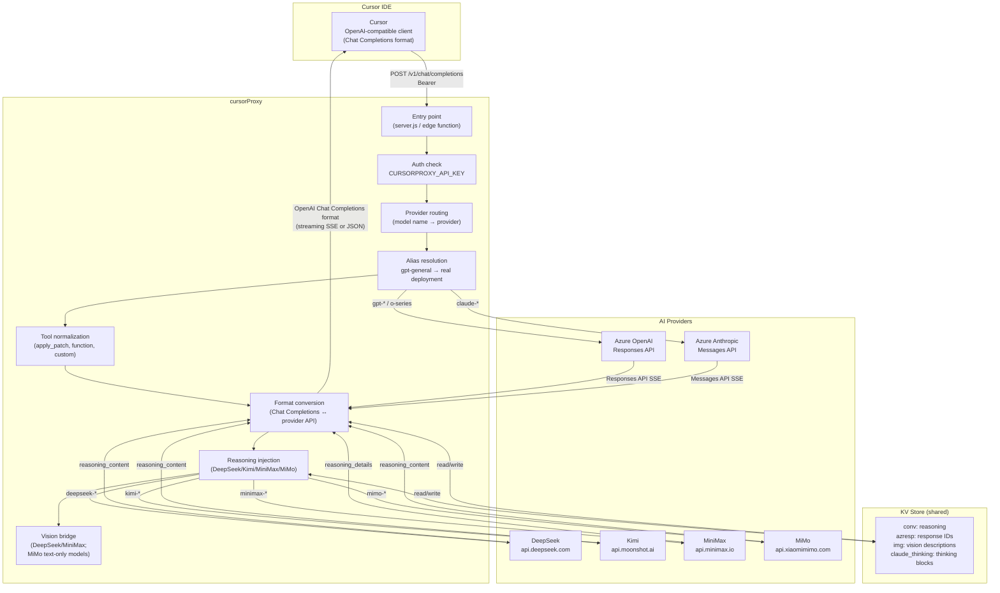
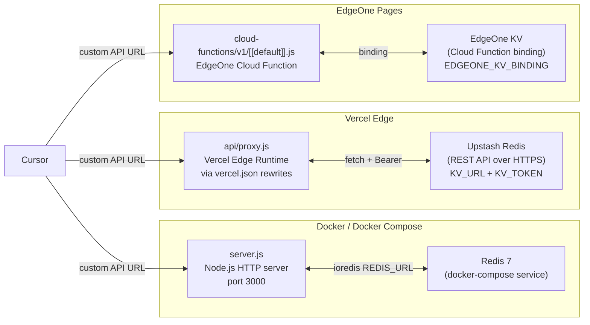
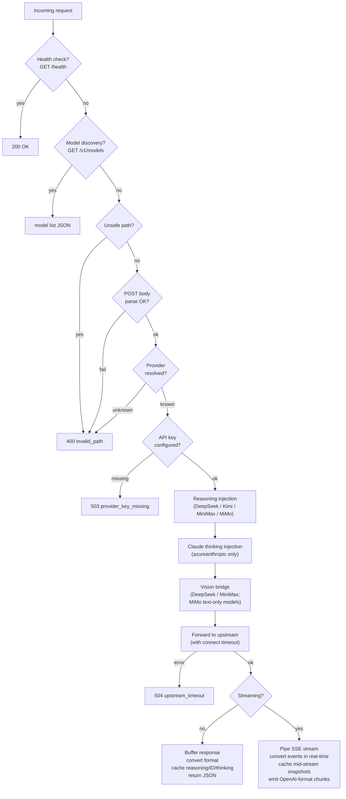
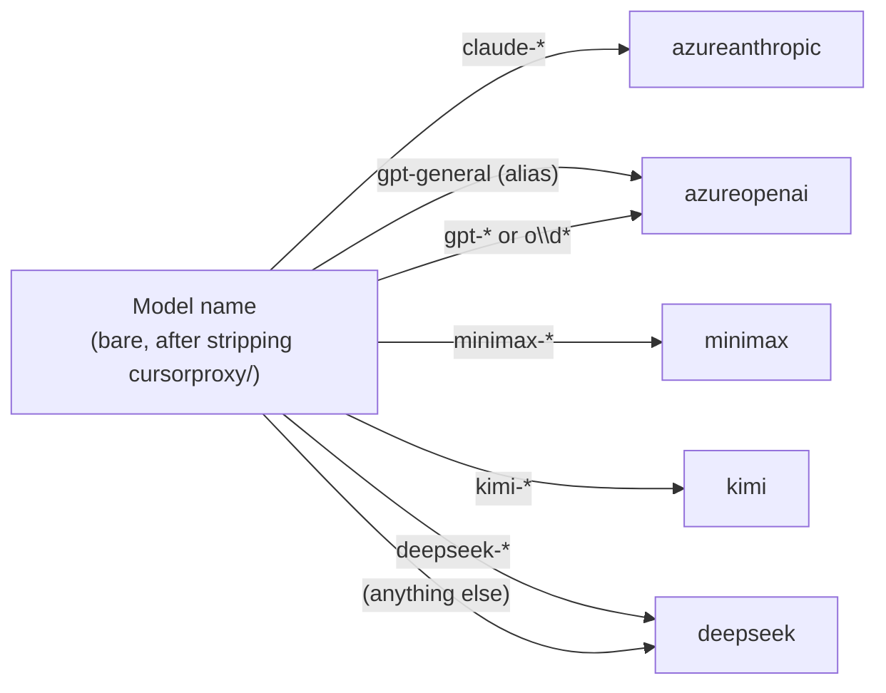

# Overall System Architecture

## Top-level Overview

## Deployment Topologies

## Request Lifecycle

## Model Name → Provider Mapping

## Component Map

| File | Role |
|---|---|
| `server.js` | HTTP server entry point (Docker) |
| `api/proxy.js` | Shared edge-safe proxy handler and Vercel entry target |
| `cloud-functions/v1/[[default]].js` | EdgeOne Cloud Function unified `/v1/*` entry point with KV binding support |
| `cloud-functions/v0/[[default]].js` | EdgeOne Cloud Function legacy unified `/v0/*` entry point |
| `cloud-functions/health.js` | EdgeOne health probe exposing KV backend status |
| `api/models.js` | Model ID parsing, alias resolution, `/v1/models` |
| `api/auth.js` | Proxy auth, timing-safe key comparison |
| `api/azure-openai.js` | Azure Responses API ↔ OpenAI Chat Completions |
| `api/azure-anthropic.js` | Azure Anthropic Messages API ↔ OpenAI Chat Completions |
| `api/reasoning.js` | Reasoning block caching and injection |
| `api/vision-bridge.js` | Batch image-to-text conversion |
| `api/vision.js` | Vision API calls (MiniMax VL-01 / GPT-4o-mini) |
| `api/cache.js` | Conversation and image hashing |
| `api/kv.js` | KV abstraction (Redis / Upstash / EdgeOne) |
| `api/logger.js` | Debug logging utility |

## Key Environment Variables (All Providers)

| Variable | Purpose |
|---|---|
| `CURSORPROXY_API_KEY` | Proxy auth gate (unset = anonymous, shared cache scope) |
| `CURSORPROXY_MODELS` | Comma/newline list of model IDs exposed at `GET /v1/models` |
| `DEBUG` | `true` enables per-request verbose logs |
| **DeepSeek** | |
| `DEEPSEEK_API_KEY` | DeepSeek auth |
| `DEEPSEEK_REASONING_EFFORT` | `high` (default) or `max` |
| **Kimi** | |
| `KIMI_API_KEY` | Kimi / Moonshot auth |
| **MiniMax** | |
| `MINIMAX_API_KEY` | MiniMax auth (also used for default vision backend) |
| **MiMo (Xiaomi)** | |
| `MIMO_API_KEY` | MiMo auth |
| `UPSTREAM_MIMO` | Optional base URL override (Token Plan, etc.); `Host` header follows this URL |
| **Azure (shared)** | |
| `AZURE_FOUNDRY_API_KEY` | Shared key for Azure OpenAI and Azure Anthropic |
| `AZURE_FOUNDRY_RESOURCE` | Azure resource name (used to build default endpoint URLs) |
| **Azure OpenAI** | |
| `AZURE_OPENAI_ENDPOINT` | Full endpoint URL override |
| `AZURE_OPENAI_API_VERSION` | API version (default `2025-04-01-preview`) |
| `AZURE_OPENAI_GENERAL_ALIAS_TARGET` | Real deployment behind `gpt-general` alias |
| `AZURE_OPENAI_GENERAL_REASONING_EFFORT` | Reasoning effort override for `gpt-general` |
| `AZURE_OPENAI_REASONING_EFFORT` | Global reasoning effort for all Azure reasoning models |
| **Azure Anthropic** | |
| `AZURE_ANTHROPIC_ENDPOINT` | Full endpoint URL override |
| **Vision** | |
| `VISION_API_PROVIDER` | `minimax_vl` (default) or `openai` |
| `VISION_API_KEY` | API key when `VISION_API_PROVIDER=openai` |
| `VISION_API_URL` | Override vision endpoint URL |
| `VISION_MODEL` | Override vision model name |
| `VISION_TIMEOUT_MS` | Per-image timeout ms (default 15 000, 0 = disabled) |
| `VISION_CONCURRENCY` | Max parallel vision calls (default 2) |
| **KV / Caching** | |
| `KV_TTL_SECONDS` | Cache TTL seconds (default 7 200 / 2 h) |
| `KV_RETRY_DELAYS_MS` | Reasoning retry delays ms, comma-separated (default `40,120,240,400`) |
| `REDIS_URL` | Local Redis (Docker) |
| `KV_URL` + `KV_TOKEN` | Upstash Redis (Vercel) |
| `EDGEONE_KV_BINDING` | EdgeOne KV namespace binding |
| **Timeouts** | |
| `UPSTREAM_CONNECT_TIMEOUT_MS` | Connect-phase timeout ms (default 15 000, 0 = disabled) |
| `STREAM_TIMEOUT_SECONDS` | Stream timeout (default 280 on Vercel, 0 disabled on EdgeOne Edge Functions and Docker) |
| `PRESTREAM_BUDGET_MS` | Vercel pre-stream wall time ms (default 22 000) |
| `SHUTDOWN_GRACE_MS` | Docker graceful drain ms (default 25 000) |
