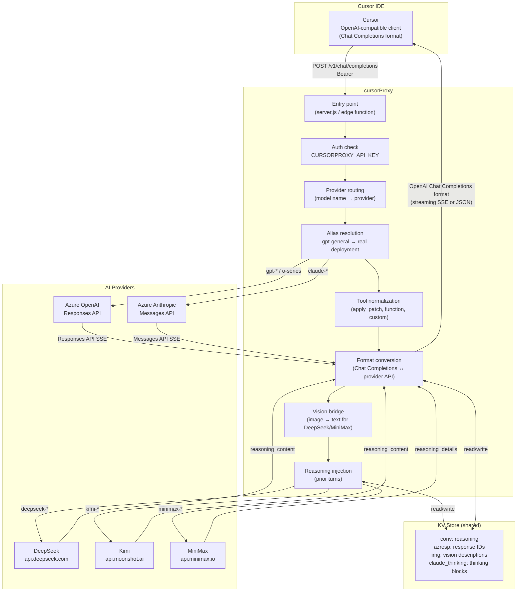
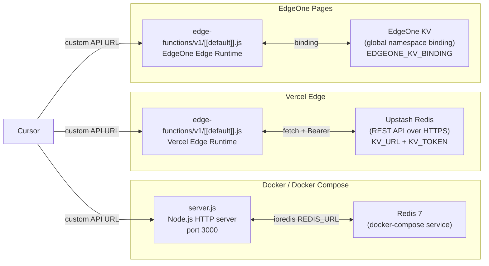
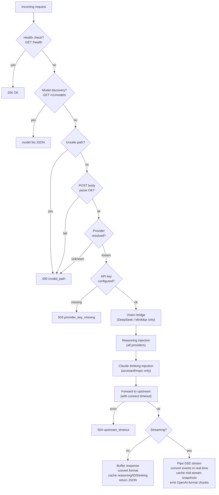
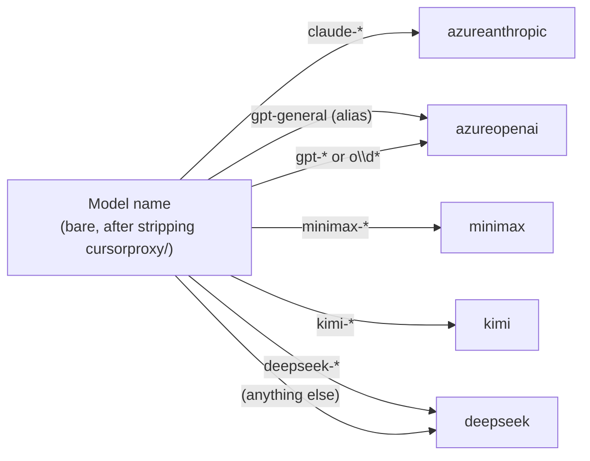

# Overall System Architecture

## Top-level Overview

## Deployment Topologies

## Request Lifecycle

## Model Name → Provider Mapping

## Component Map

| File | Role |
|---|---|
| `server.js` | HTTP server entry point (Docker) |
| `edge-functions/v1/[[default]].js` | Edge entry point (Vercel / EdgeOne) |
| `api/proxy.js` | Core handler: routing, conversion, streaming |
| `api/models.js` | Model ID parsing, alias resolution, `/v1/models` |
| `api/auth.js` | Proxy auth, timing-safe key comparison |
| `api/azure-openai.js` | Azure Responses API ↔ OpenAI Chat Completions |
| `api/azure-anthropic.js` | Azure Anthropic Messages API ↔ OpenAI Chat Completions |
| `api/reasoning.js` | Reasoning block caching and injection |
| `api/vision-bridge.js` | Batch image-to-text conversion |
| `api/vision.js` | Vision API calls (MiniMax VL-01 / GPT-4o-mini) |
| `api/cache.js` | Conversation and image hashing |
| `api/kv.js` | KV abstraction (Redis / Upstash / EdgeOne) |
| `api/logger.js` | Debug logging utility |
