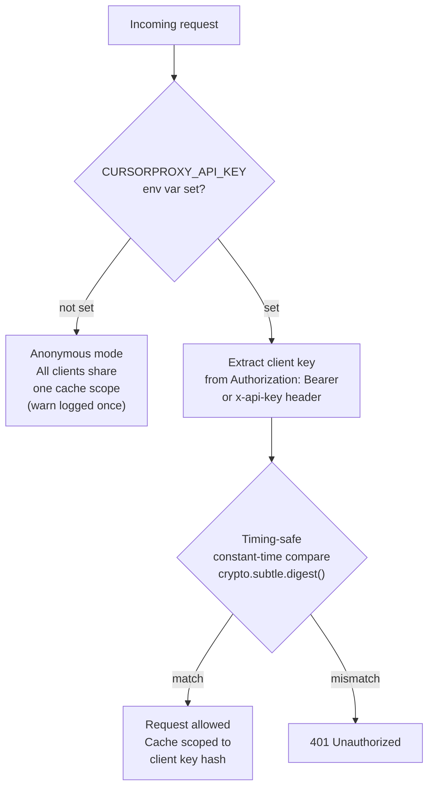
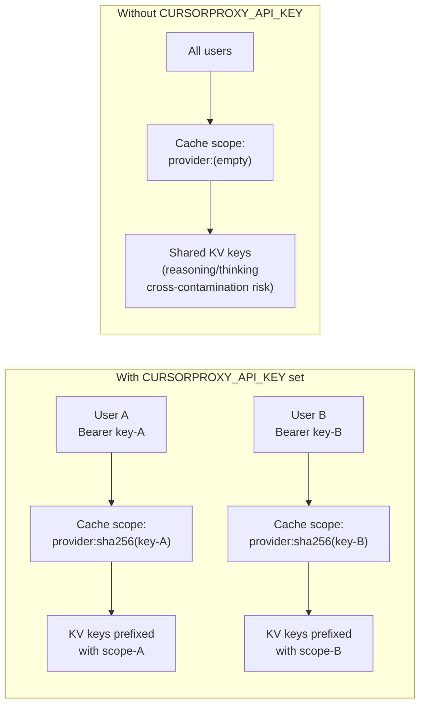
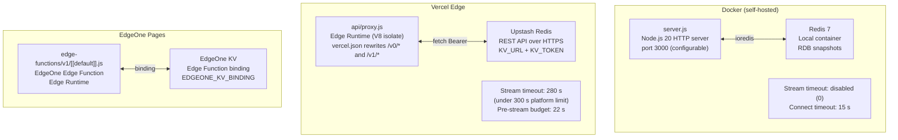
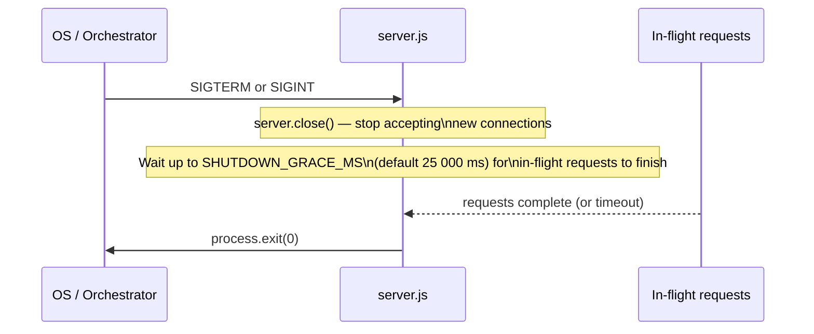
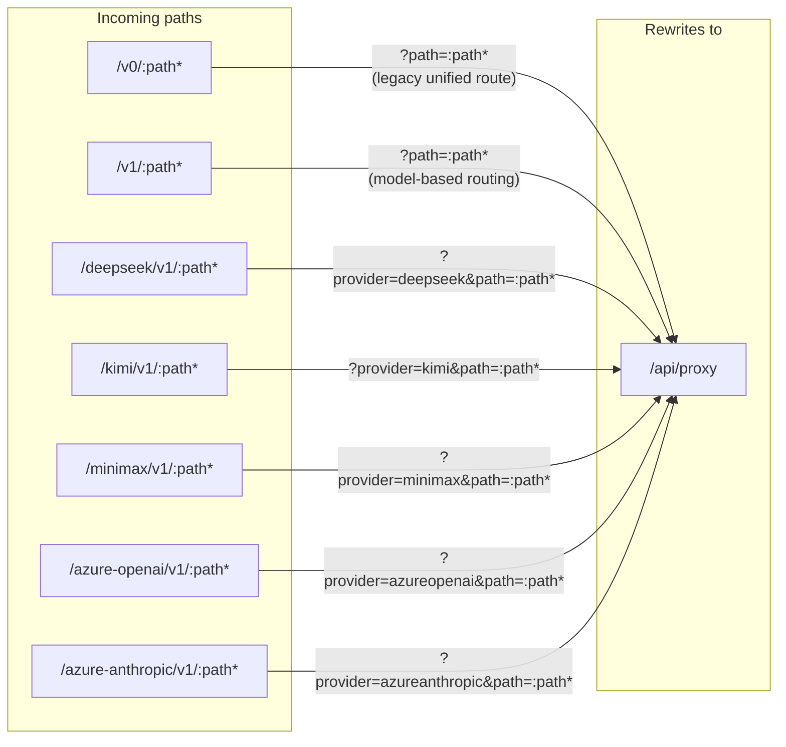

# Authentication, Cache Scoping & Deployment Modes

## Authentication Flow

> Timing-safe comparison prevents timing-oracle attacks where an attacker
> measures response time differences to guess the key character-by-character.

## Cache Scope Isolation Per User

## Deployment Modes Comparison

## Deployment Mode Feature Matrix

| Feature | Docker | Vercel Edge | EdgeOne Pages |
|---|---|---|---|
| Entry point | `server.js` | `api/proxy.js` via `vercel.json` rewrites | `edge-functions/v1/[[default]].js` |
| KV backend | Local Redis (ioredis) | Upstash REST | EdgeOne KV binding |
| Stream timeout | Disabled | 280 s | Disabled by default |
| Pre-stream budget guard | No | Yes (22 s default) | No |
| Graceful shutdown | Yes (25 s drain) | N/A (stateless) | N/A (stateless) |
| Access logging | Yes (DEBUG=true) | Yes (DEBUG=true) | Yes (DEBUG=true, Edge Function logs) |
| Health check | `GET /health` | N/A | `GET /health` |

## EdgeOne KV Runtime

EdgeOne Pages KV is exposed to Edge Functions, so the proxy routes `/v0/*`,
`/v1/*`, and legacy provider paths through `edge-functions/`. The default KV
binding variable name is `cursorproxy_kv`; set `EDGEONE_KV_BINDING` only if you
bind the namespace under a different variable name.

Do not add same-path Cloud Function entry files for these API routes unless you
also switch to another KV backend such as Upstash. Cloud Functions do not receive
the built-in EdgeOne Pages KV binding, so reasoning, response-id, Claude thinking,
and image caches would no-op. Use `DEBUG=true` only while troubleshooting because
it logs request routing and proxy internals.

## Docker Graceful Shutdown

## URL Routing (Vercel Rewrites)

## Environment Variables Reference

### Common

| Variable | Purpose |
|---|---|
| `CURSORPROXY_API_KEY` | Proxy auth key (unset = anonymous) |
| `CURSORPROXY_MODELS` | Comma/newline-separated list of model IDs for `/v1/models` |
| `DEBUG` | `true` to enable per-request debug logs |
| `KV_TTL_SECONDS` | Cache TTL for all key types (default 7 200 s) |

### KV Backends

| Variable | Backend |
|---|---|
| `REDIS_URL` | Docker local Redis |
| `KV_URL` + `KV_TOKEN` | Upstash (Vercel) |
| `EDGEONE_KV_BINDING` | EdgeOne Pages KV |

### Timeouts

| Variable | Default | Notes |
|---|---|---|
| `UPSTREAM_CONNECT_TIMEOUT_MS` | 15 000 | Connect-phase only; set 0 to disable |
| `STREAM_TIMEOUT_SECONDS` | 280 (Vercel) / 0 (EdgeOne Edge Functions and Docker default) | 0 = disabled |
| `PRESTREAM_BUDGET_MS` | 22 000 | Vercel only |
| `SHUTDOWN_GRACE_MS` | 25 000 | Docker only |
