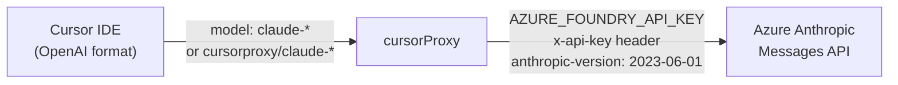
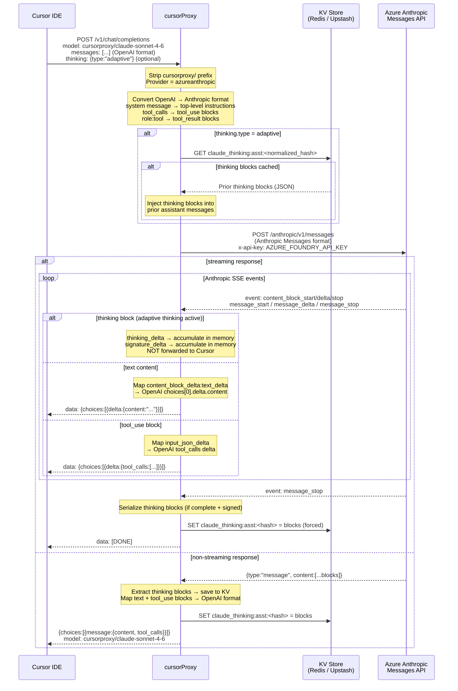
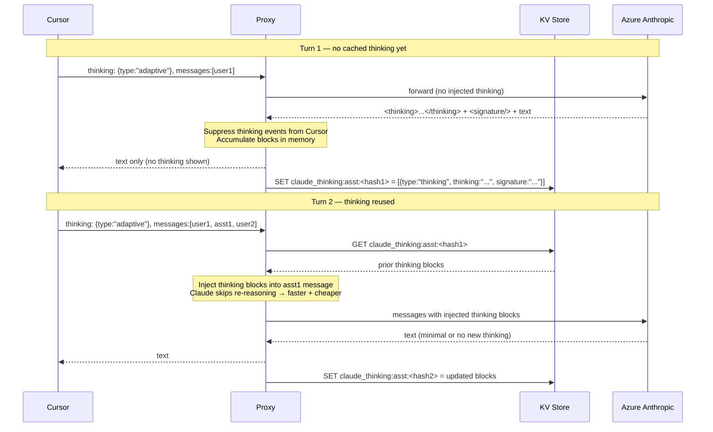
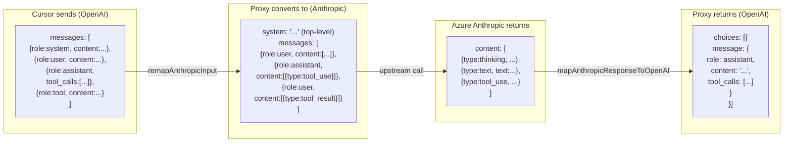

# Azure Anthropic (Claude Family) Flow

## Model Routing

## Request / Response Flow

## Claude Thinking Block Caching (Adaptive Thinking)

## Format Conversion Reference

## Key Environment Variables

| Variable | Purpose |
|---|---|
| `AZURE_FOUNDRY_API_KEY` | Shared key for Azure Foundry (Anthropic + OpenAI) |
| `AZURE_ANTHROPIC_ENDPOINT` | Full endpoint URL (overrides AZURE_FOUNDRY_RESOURCE) |
| `AZURE_FOUNDRY_RESOURCE` | Azure resource name (used to build default endpoint) |
| `AZURE_ANTHROPIC_THINKING` | Default thinking mode when request omits `thinking` (`adaptive` or `disabled`) |
| `AZURE_ANTHROPIC_EFFORT` | Default Claude effort when request omits `output_config.effort` (`low`, `medium`, `high`, `max`) |
| `KV_URL` / `KV_TOKEN` | Upstash Redis (Vercel) |
| `REDIS_URL` | Local Redis (Docker) |
| `KV_TTL_SECONDS` | Cache TTL (default 7200 s / 2 h) |
