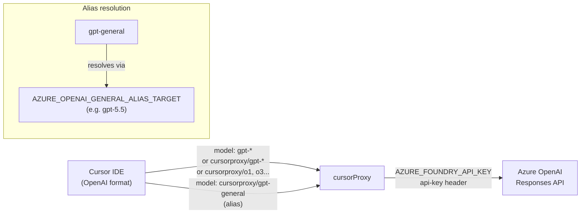
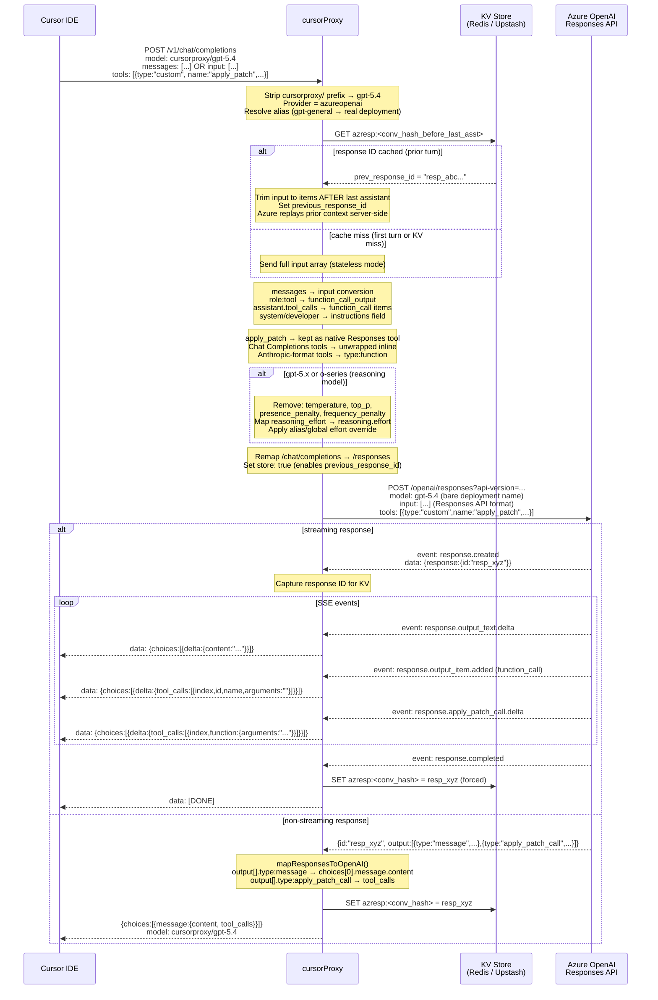
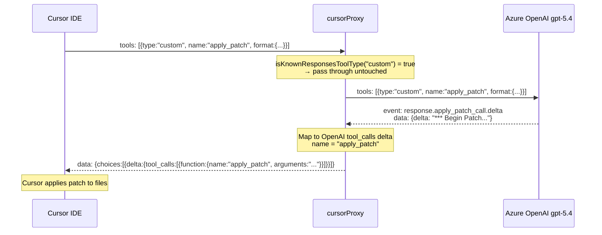
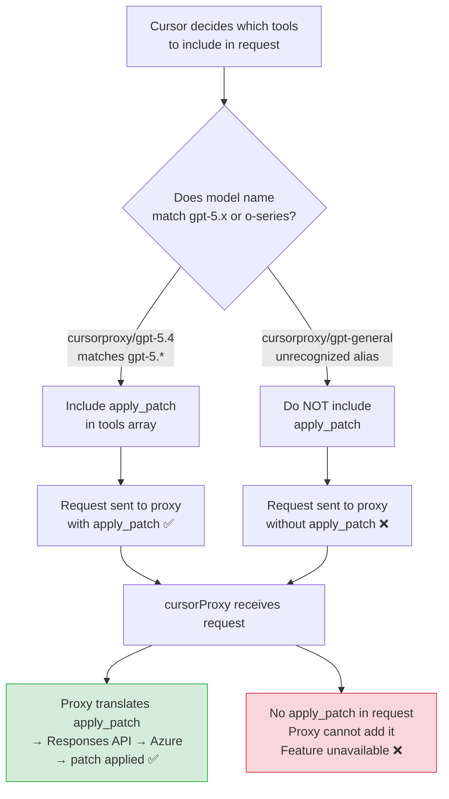
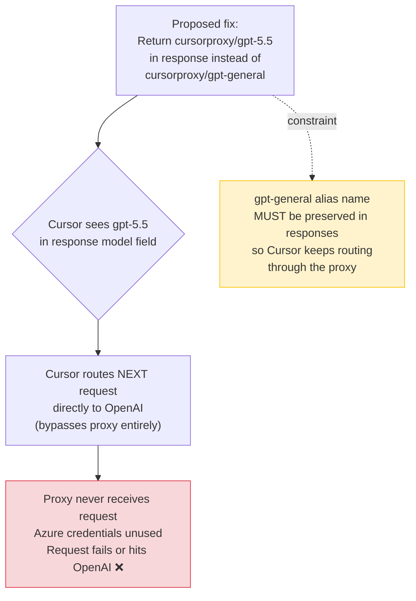
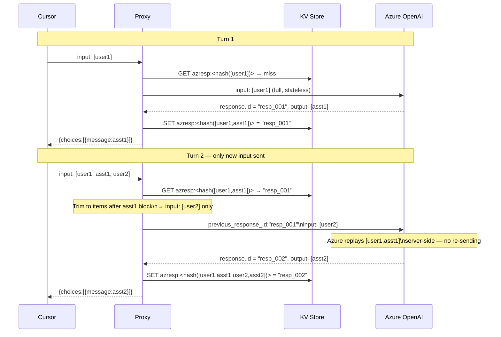

# Azure OpenAI (GPT / o-series) Flow

## Model Routing

## Full Request / Response Flow

## apply_patch Tool Flow (gpt-5.4 — works)

## gpt-general Alias — Why apply_patch Is Missing

## Why the Simple Fix Does Not Work

## Response ID Chaining (Multi-turn Efficiency)

## Key Environment Variables

| Variable | Purpose |
|---|---|
| `AZURE_FOUNDRY_API_KEY` | Shared key for Azure Foundry |
| `AZURE_OPENAI_ENDPOINT` | Full endpoint URL (overrides resource-based default) |
| `AZURE_FOUNDRY_RESOURCE` | Azure resource name |
| `AZURE_OPENAI_API_VERSION` | API version (default `2025-04-01-preview`) |
| `AZURE_OPENAI_GENERAL_ALIAS_TARGET` | Real deployment behind `gpt-general` (e.g. `gpt-5.5`) |
| `AZURE_OPENAI_GENERAL_REASONING_EFFORT` | Effort override for `gpt-general` requests |
| `AZURE_OPENAI_REASONING_EFFORT` | Global reasoning effort for all reasoning models |
| `KV_URL` / `KV_TOKEN` | Upstash Redis (Vercel) |
| `REDIS_URL` | Local Redis (Docker) |
| `KV_TTL_SECONDS` | Cache TTL (default 7200 s / 2 h) |
