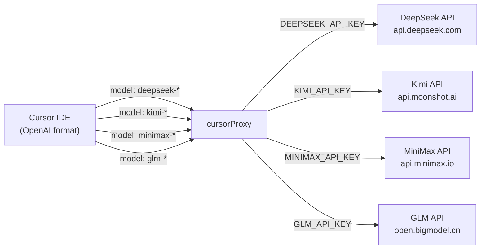
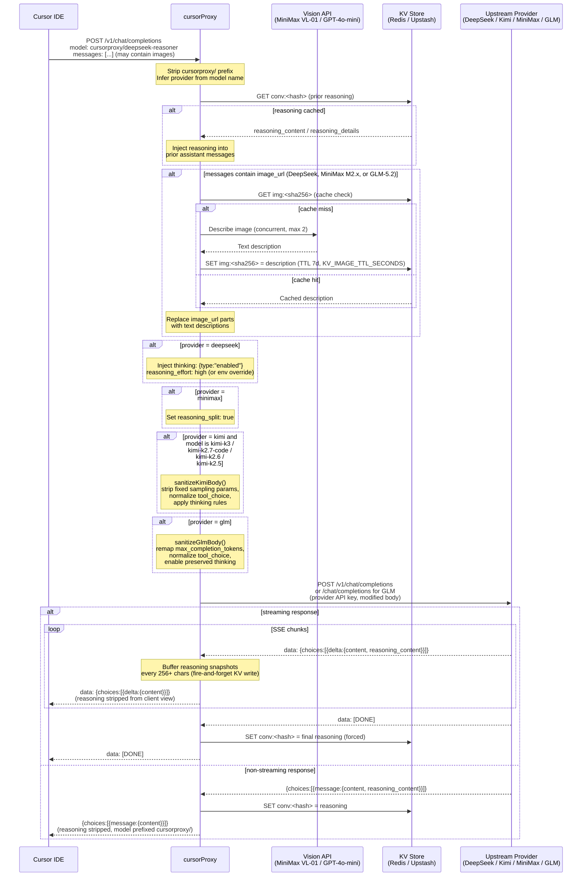
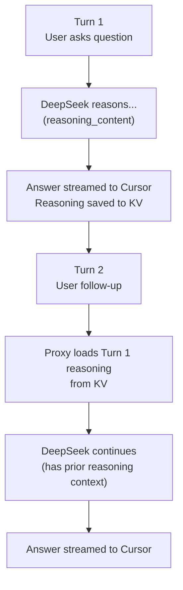
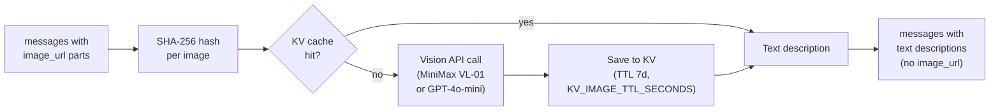

# DeepSeek / Kimi / MiniMax / GLM Provider Flow

## Model Routing

## Request / Response Flow

## Reasoning Caching (Multi-turn Reuse)

## Vision Bridge Detail (DeepSeek, MiniMax M2.x, GLM-5.2)

## Kimi Request Sanitization

Implementation lives in `lib/kimi.js` (`sanitizeKimiBody`). It runs for Kimi
thinking models before the reasoning bridge injects cached `reasoning_content`.
The default Kimi model is `kimi-k3`.

| Model | Thinking behavior | Proxy action |
|---|---|---|
| `kimi-k3` | Always on; full historical assistant messages must retain reasoning | Delete `thinking`; remove fixed sampling fields; force `reasoning_effort: "max"`; preserve forced `tool_choice` and `max_completion_tokens` |
| `kimi-k2.7-code` | Always on; Preserved Thinking always on; do not pass `thinking` | Delete `thinking`; strip fixed sampling params |
| `kimi-k2.6` | On by default; supports `thinking.keep: "all"` | Inject `{ type: "enabled", keep: "all" }` unless client disables thinking |
| `kimi-k2.5` | On by default; no `keep` support | Inject `{ type: "enabled" }` when omitted; strip `thinking.keep` |

The K2.x tiers also:

- Remove `temperature`, `top_p`, `n`, `presence_penalty`, `frequency_penalty`, and `reasoning_effort` (non-default values 400 upstream)
- Coerce unsupported `tool_choice` to `auto`
- Remap `max_completion_tokens` → `max_tokens` and floor low `max_tokens` to 16k

K3 removes the same fixed sampling fields but keeps `max_completion_tokens`
unchanged and does not rewrite `required` or named function tool choices. Its
reasoning cache scope includes `kimi-k3`; K2.x retains the legacy `kimi:<user>`
scope so existing cached conversations remain valid.

Kimi remains natively multimodal (images and video); the vision bridge is not used.

## GLM-5.2 Request Sanitization

Implementation lives in `lib/glm.js` (`sanitizeGlmBody`). It runs for GLM models
before the reasoning bridge injects cached `reasoning_content`.

- Default model is `glm-5.2`; `GLM-5.2` is accepted and forwarded to upstream as lowercase.
- Default upstream is ZHIPU China Coding Plan: `https://open.bigmodel.cn/api/coding/paas/v4`.
- Set `UPSTREAM_GLM=https://api.z.ai/api/coding/paas/v4` for the global Z.AI Coding Plan endpoint.
- The proxy remaps `max_completion_tokens` to `max_tokens`, coerces unsupported forced-tool choices to `auto`, preserves `tool_choice: "none"` by removing tools, sets `tool_stream: true` for streamed tool requests, and injects `thinking: { type: "enabled", clear_thinking: false }` when omitted.
- GLM `reasoning_content` is cached and replayed when available. On cache miss, the proxy does not inject placeholder reasoning and sets `clear_thinking: true` for that request because Z.AI requires preserved thinking to remain complete and unmodified.

## Key Environment Variables

| Variable | Purpose |
|---|---|
| `DEEPSEEK_API_KEY` | DeepSeek auth |
| `KIMI_API_KEY` | Kimi / Moonshot auth |
| `MINIMAX_API_KEY` | MiniMax auth (also used for `minimax_vl` vision backend) |
| `GLM_API_KEY` | GLM / ZHIPU AI auth |
| `UPSTREAM_GLM` | Optional GLM Coding Plan endpoint override |
| `DEEPSEEK_REASONING_EFFORT` | `high` (default) or `max` |
| `VISION_API_PROVIDER` | `minimax_vl` (default) or `openai` |
| `VISION_API_KEY` | API key when `VISION_API_PROVIDER=openai` |
| `VISION_TIMEOUT_MS` | Per-image timeout (default 15 000 ms, 0 = disabled) |
| `VISION_CONCURRENCY` | Max parallel vision calls (default 2) |
| `KV_RETRY_DELAYS_MS` | Reasoning KV retry delays in ms, comma-separated (default `40,120,240,400`) |
| `KV_URL` / `KV_TOKEN` | Upstash Redis (Vercel) |
| `REDIS_URL` | Local Redis (Docker) |
