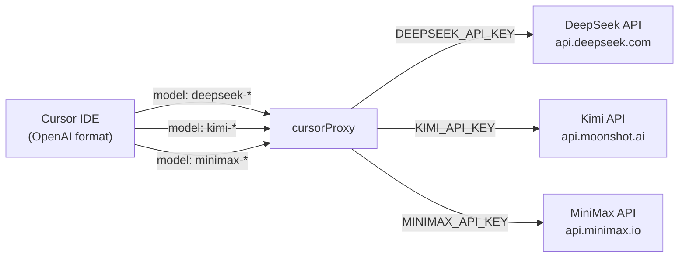
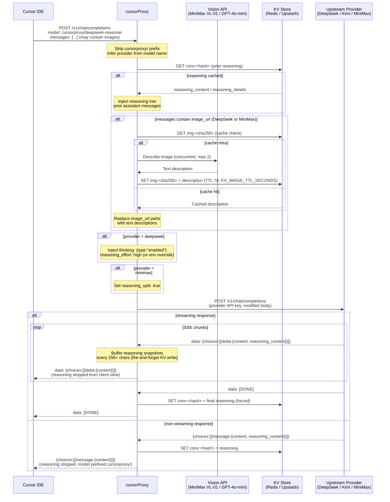
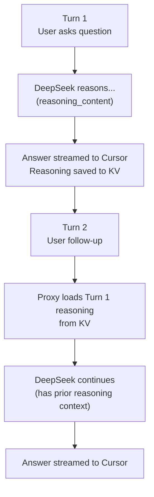
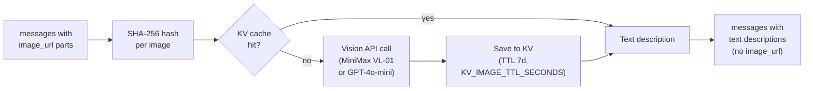

# DeepSeek / Kimi / MiniMax Provider Flow

## Model Routing

## Request / Response Flow

## Reasoning Caching (Multi-turn Reuse)

## Vision Bridge Detail (DeepSeek & MiniMax)

## Key Environment Variables

| Variable | Purpose |
|---|---|
| `DEEPSEEK_API_KEY` | DeepSeek auth |
| `KIMI_API_KEY` | Kimi / Moonshot auth |
| `MINIMAX_API_KEY` | MiniMax auth (also used for `minimax_vl` vision backend) |
| `DEEPSEEK_REASONING_EFFORT` | `high` (default) or `max` |
| `VISION_API_PROVIDER` | `minimax_vl` (default) or `openai` |
| `VISION_API_KEY` | API key when `VISION_API_PROVIDER=openai` |
| `VISION_TIMEOUT_MS` | Per-image timeout (default 15 000 ms, 0 = disabled) |
| `VISION_CONCURRENCY` | Max parallel vision calls (default 2) |
| `KV_RETRY_DELAYS_MS` | Reasoning KV retry delays in ms, comma-separated (default `40,120,240,400`) |
| `KV_URL` / `KV_TOKEN` | Upstash Redis (Vercel) |
| `REDIS_URL` | Local Redis (Docker) |
