# Known Issue: `gpt-general` Does Not Receive apply_patch Tools

## Summary

When using the `gpt-general` alias, Cursor never includes the `apply_patch`
(batch apply) tool in requests — even though the underlying deployment (e.g.
`gpt-5.5`) fully supports it. The proxy itself handles `apply_patch` correctly;
the problem is that Cursor decides which tools to send **before** the request
reaches the proxy, based solely on the model name it sees.

---

## Root Cause

### Step 1 — Cursor tool selection is model-name driven

Cursor checks the model name against an internal pattern (equivalent to the
proxy's own `isAzureReasoningModel` regex) to decide which tools to include:

```
/^(?:o\d(?:[-.]|$)|gpt-5(?:\.\d+)?(?:[-.]|$))/i
```

| Model Cursor sees | Matches pattern | apply_patch sent? |
|---|---|---|
| `cursorproxy/gpt-5.4` | ✅ yes | ✅ yes |
| `cursorproxy/gpt-general` | ❌ no (alias, not a gpt-5.x name) | ❌ never |

### Step 2 — The proxy preserves the alias name in responses

The proxy intentionally stamps `cursorproxy/gpt-general` into every response
chunk (`proxy.js:616-618`) so the raw Azure deployment name is not leaked to
clients. As a result, Cursor always sees `gpt-general` — never the real
`gpt-5.5` underneath — and never activates the apply_patch tool surface.

### Step 3 — The naive fix breaks proxy routing

Returning `cursorproxy/gpt-5.5` in responses instead of `cursorproxy/gpt-general`
would cause Cursor to route subsequent requests **directly to OpenAI**, bypassing
the proxy entirely.

This is a confirmed Cursor behaviour: as of ~May 4 2025, Cursor stopped routing
`gpt-5.5` named models through custom base URLs and began sending them directly
to OpenAI.

**Official Cursor bug report:**
> *GPT-5.5 BYOK not working* — Cursor no longer sends requests for the GPT-5.5
> model to the configured custom backend. Was working until May 4th.
> https://forum.cursor.com/t/gpt-5-5-byok-not-working/160004

---

## Flow Comparison

```mermaid
flowchart TD
    subgraph "gpt-5.4 — works end-to-end"
        A1["Cursor sees model:\ncursorproxy/gpt-5.4"]
        A2["Pattern match ✅\n→ include apply_patch in tools"]
        A3["Request arrives at proxy\nwith apply_patch tool"]
        A4["Proxy passes apply_patch\nto Azure Responses API"]
        A5["Azure executes patch\nresult streamed back ✅"]
        A1 --> A2 --> A3 --> A4 --> A5
    end

    subgraph "gpt-general — broken at Cursor side"
        B1["Cursor sees model:\ncursorproxy/gpt-general"]
        B2["Pattern match ❌\n→ apply_patch NOT included"]
        B3["Request arrives at proxy\nwithout apply_patch tool"]
        B4["Proxy has nothing\nto forward ❌"]
        B1 --> B2 --> B3 --> B4
    end

    style A5 fill:#d4edda,stroke:#28a745
    style B4 fill:#f8d7da,stroke:#dc3545
```



---

## Why the Fix Must Come from Cursor

The proxy cannot solve this unilaterally:

| Option | Problem |
|---|---|
| Return `cursorproxy/gpt-5.5` in responses | Cursor routes next request directly to OpenAI — proxy bypassed |
| Return `cursorproxy/gpt-general` (current) | Cursor never sends apply_patch |
| Inject apply_patch into every request | Cursor's agent mode controls the tool list; proxy cannot add tools that Cursor didn't request |

The fix requires Cursor to either:
- Allow users to declare model capabilities independently of the model name, **or**
- Re-enable BYOK routing for `gpt-5.5` / `gpt-5.x` named models through custom base URLs

---

## Current Workaround

Use `cursorproxy/gpt-5.4` directly instead of `gpt-general`.

- `gpt-5.4` still routes through the custom base URL (not yet intercepted by Cursor)
- Cursor recognises it as a gpt-5.x model and includes apply_patch
- Set `CURSORPROXY_MODELS` to expose `gpt-5.4` alongside `gpt-general`

**Risk:** Cursor may intercept `gpt-5.4` in a future update, as it did with
`gpt-5.5`. This is a temporary mitigation, not a permanent fix.

---

## Affected Components

| Component | Role | Fixable here? |
|---|---|---|
| `api/models.js` — `withPublicResponseModel` | Forces alias name in responses | No — changing this breaks routing |
| `api/proxy.js:616-618` — `azureAliasPublicId` | Preserves alias as response model | No — same constraint |
| Cursor IDE — tool selection logic | Decides which tools to include based on model name | Requires Cursor fix |
| Cursor IDE — BYOK routing for gpt-5.5 | Stopped routing gpt-5.5 through custom URLs | Requires Cursor fix |

---

## Related Links

- Cursor forum bug: [GPT-5.5 BYOK not working](https://forum.cursor.com/t/gpt-5-5-byok-not-working/160004)
- Proxy alias implementation: `api/models.js` — `resolveAzureAlias()`, `AZURE_OPENAI_ALIASES`
- Proxy response model stamping: `api/proxy.js:616-618`, `api/models.js` — `withPublicResponseModel()`
- apply_patch tool handling: `api/azure-openai.js` — `AZURE_OPENAI_RESPONSES_TOOL_TYPES`, `normalizeAzureOpenAITools()`, `mapResponsesSSEToOpenAI()`
