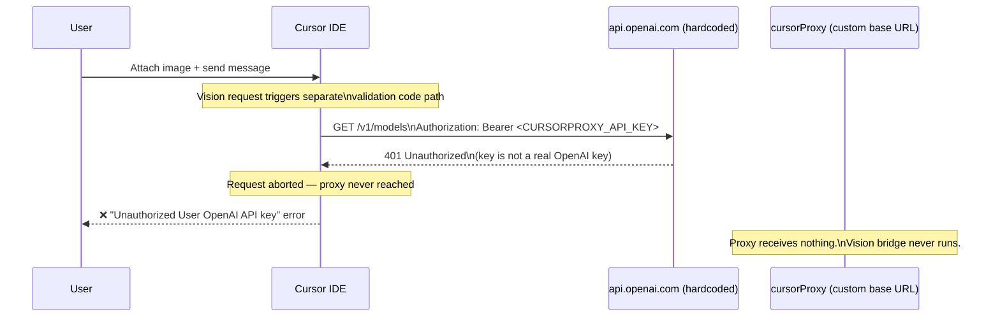
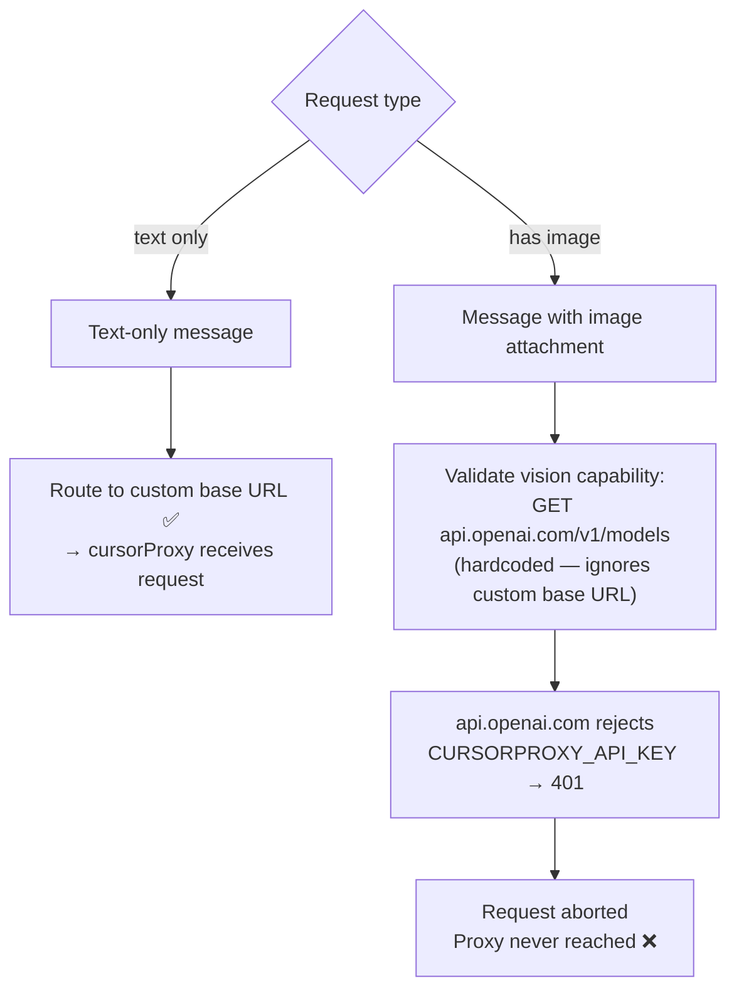
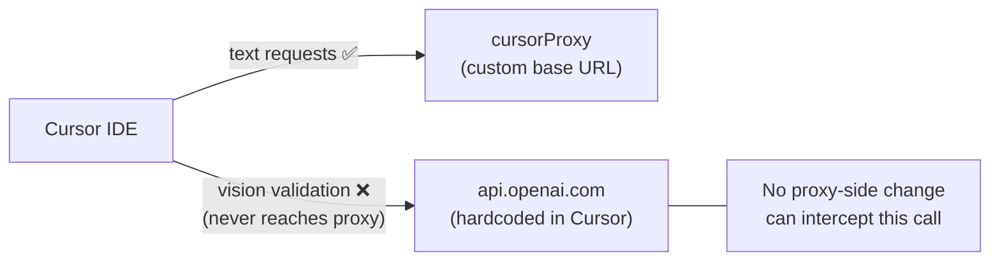

# Known Issue: Vision / Image Attachment Broken with BYOK + Custom Base URL

## Summary

When Cursor is configured with a custom OpenAI base URL (BYOK), attaching any
image to a chat fails with an `Unauthorized` / 401 error. Text-only requests
work correctly. The bug is triggered by a hardcoded validation path inside
Cursor that sends image-related capability checks to `api.openai.com` directly,
ignoring the configured custom base URL entirely.

**Official Cursor bug report:**
https://forum.cursor.com/t/bug-images-vision-completely-broken-with-openai-byok-custom-endpoint-override-unauthorized-error/158460

**Cursor staff response:** Confirmed known issue. No ETA on fix.

**Related older report (same root cause):**
https://forum.cursor.com/t/images-break-custom-openai-endpoint-config/116176

---

## What Happens

---

## Root Cause

Cursor has two separate code paths:

The BYOK API key the user entered (i.e., `CURSORPROXY_API_KEY`) is not a valid
OpenAI key. When Cursor sends it to `api.openai.com` for validation, OpenAI
rejects it, and Cursor aborts the entire request before the proxy ever sees it.

---

## Impact on cursorProxy

| Provider | Vision behavior | Affected by this bug? |
|---|---|---|
| DeepSeek | Proxy vision bridge converts images to text | ✅ Yes — Cursor aborts before proxy receives request |
| MiniMax | Proxy vision bridge converts images to text | ✅ Yes — same |
| Kimi | Provider supports vision natively | ✅ Yes — same |
| Azure OpenAI (gpt-5.x) | Provider supports vision natively | ✅ Yes — same |
| Azure Anthropic (Claude) | Provider supports vision natively | ✅ Yes — same |

All providers are affected equally — the failure happens at Cursor's validation
step before the request reaches the proxy.

---

## Why the Proxy Cannot Fix This

The validation request goes from Cursor directly to `api.openai.com` — it never
touches the proxy infrastructure. Even if the proxy returned a perfectly valid
`/v1/models` response, Cursor does not call the proxy for this check.

---

## Partial Mitigation (DeepSeek / MiniMax Only)

The proxy's vision bridge is designed exactly to handle providers that don't
support inline images. **If Cursor ever sends the image-containing request to
the proxy** (i.e., if the validation bug is fixed or bypassed), the proxy will:

1. Detect `image_url` parts in messages
2. Call MiniMax VL-01 or GPT-4o-mini to generate a text description
3. Replace image parts with text descriptions before forwarding to DeepSeek/MiniMax

This means the proxy is already prepared for vision on these providers — it is
only blocked by Cursor's client-side validation bug.

For Azure OpenAI and Azure Anthropic (which support vision natively), the proxy
would simply pass the images through to Azure directly once Cursor sends them.

---

## Workarounds

| Workaround | Works? | Notes |
|---|---|---|
| Use text-only (no image attachments) | ✅ | Only option currently |
| Use Cursor's native models (non-BYOK) | ✅ | Loses proxy benefits |
| Put a real OpenAI key + let Cursor call OpenAI for validation | ⚠️ | Cursor may route image requests to OpenAI directly, not proxy |
| Use Cursor's built-in Azure OpenAI integration (not BYOK) | ⚠️ | Different setup; loses proxy routing |

There is currently **no reliable workaround** that preserves BYOK + custom
base URL + image support simultaneously.

---

## Affected Components

| Component | Role | Fixable here? |
|---|---|---|
| Cursor IDE — multimodal validation path | Hardcodes `api.openai.com` for `/v1/models` check on image requests | Requires Cursor fix |
| `api/vision-bridge.js` | Proxy vision bridge (ready and correct) | N/A — never reached |
| `api/vision.js` | Vision API calls (MiniMax VL-01 / GPT-4o-mini) | N/A — never reached |
| `api/proxy.js` | Main request handler | N/A — request aborted before arrival |

---

## Related Links

- **Primary bug report:** [Images/vision broken with OpenAI BYOK + custom endpoint](https://forum.cursor.com/t/bug-images-vision-completely-broken-with-openai-byok-custom-endpoint-override-unauthorized-error/158460)
- **Older duplicate:** [Images break custom OpenAI endpoint config](https://forum.cursor.com/t/images-break-custom-openai-endpoint-config/116176)
- **Related:** [OpenAI BYOK chat with image throws error](https://forum.cursor.com/t/openai-byok-chat-with-image-throws-the-error/157088)
- **Proxy vision bridge doc:** [vision-bridge.md](./vision-bridge.md)
