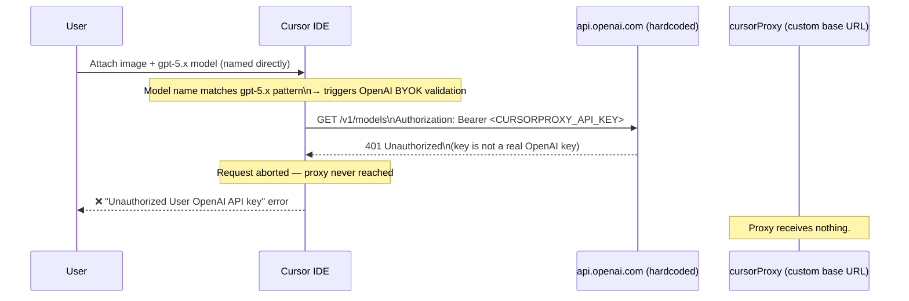
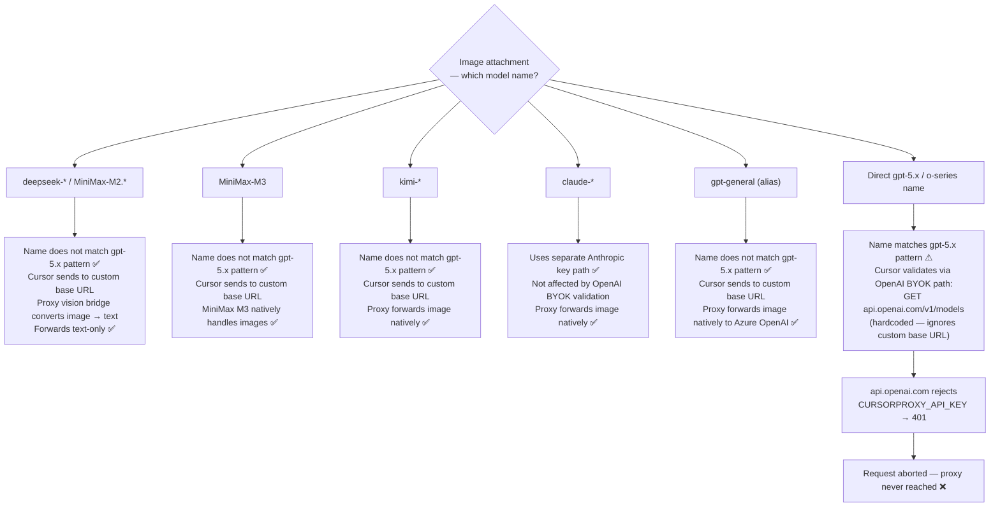

# Known Issues

> **User-facing version:** [Known Issues](https://github.com/lqdflying/cursorProxy/wiki/Known-Issues)

Cursor-side bugs that affect cursorProxy users. These cannot be fixed in the
proxy — they require a fix from the Cursor team.

---

## Issue 1 — `gpt-general` Does Not Receive apply_patch Tools

**Status:** Open — requires Cursor fix
**Cursor bug:** https://forum.cursor.com/t/gpt-5-5-byok-not-working/160004

### Summary

When using the `gpt-general` alias, Cursor never includes the `apply_patch`
(batch apply) tool in requests — even though the underlying deployment (e.g.
`gpt-5.5`) fully supports it. The proxy handles `apply_patch` correctly; the
problem is that Cursor decides which tools to send **before** the request
reaches the proxy, based solely on the model name it sees.

### Root Cause

**Step 1 — Cursor tool selection is model-name driven**

Cursor checks the model name against an internal pattern (equivalent to the
proxy's own `isAzureReasoningModel` regex) to decide which tools to include:

```
/^(?:o\d(?:[-.]|$)|gpt-5(?:\.\d+)?(?:[-.]|$))/i
```

| Model Cursor sees | Matches pattern | apply_patch sent? |
|---|---|---|
| `cursorproxy/gpt-5.4` | ✅ yes | ✅ yes |
| `cursorproxy/gpt-general` | ❌ no (alias, not a gpt-5.x name) | ❌ never |

**Step 2 — The proxy preserves the alias name in responses**

The proxy intentionally stamps `cursorproxy/gpt-general` into every response
chunk (`proxy.js:616-618`) so the raw Azure deployment name is not leaked to
clients. Cursor always sees `gpt-general` — never the real `gpt-5.5` — and
never activates the apply_patch tool surface.

**Step 3 — The naive fix breaks proxy routing**

Returning `cursorproxy/gpt-5.5` in responses would cause Cursor to route
subsequent requests directly to OpenAI, bypassing the proxy entirely. In
affected Cursor builds, directly named GPT-5 models are not kept on the custom
base URL path.

### Flow Comparison

```mermaid
flowchart TD
    subgraph "Direct GPT-5 / o-series name"
        A1["Cursor sees model:\ncursorproxy/gpt-5.x or o-series"]
        A2["Pattern match ✅\n→ include apply_patch in tools"]
        A3["Request arrives at proxy\nwith apply_patch tool"]
        A4["Proxy passes apply_patch\nto Azure Responses API"]
        A5["Azure executes patch ✅"]
        A1 --> A2 --> A3 --> A4 --> A5
    end

    subgraph "gpt-general — broken at Cursor side"
        B1["Cursor sees model:\ncursorproxy/gpt-general"]
        B2["Pattern match ❌\n→ apply_patch NOT included"]
        B3["Request arrives at proxy\nwithout apply_patch tool"]
        B4["Proxy has nothing to forward ❌"]
        B1 --> B2 --> B3 --> B4
    end
```



### Why the Proxy Cannot Fix This

| Option | Problem |
|---|---|
| Return `cursorproxy/gpt-5.5` in responses | Cursor routes next request directly to OpenAI — proxy bypassed |
| Return `cursorproxy/gpt-general` (current) | Cursor never sends apply_patch |
| Inject apply_patch into every request | Cursor controls the tool list; proxy cannot add tools Cursor didn't send |

### Current Workaround

Use a directly named GPT-5 / o-series deployment only if your current Cursor
build still sends that model through the custom base URL. For some users this
has been `cursorproxy/gpt-5.4`, but the exact working name is Cursor-version
dependent.

- Cursor recognises direct GPT-5 / o-series names and includes `apply_patch`
- Some direct names may still route through the proxy, while others may be
  intercepted by Cursor before they reach the custom base URL
- If you find one that still routes correctly in your setup, add it to
  `CURSORPROXY_MODELS` alongside `gpt-general`

**Risk:** This is a temporary mitigation, not a permanent fix. A direct model
name that works in one Cursor release may stop routing through the proxy in a
later release.

### Affected Proxy Files

| File | Role | Fixable here? |
|---|---|---|
| `api/models.js` — `withPublicResponseModel` | Forces alias name in responses | No — changing this breaks routing |
| `api/proxy.js:616-618` — `azureAliasPublicId` | Preserves alias as response model | No — same constraint |

---

## Issue 2 — Vision / Image Attachment Broken with BYOK + Custom Base URL

**Status:** Open — confirmed by Cursor staff, no ETA
**Cursor bug:** https://forum.cursor.com/t/bug-images-vision-completely-broken-with-openai-byok-custom-endpoint-override-unauthorized-error/158460
**Older duplicate:** https://forum.cursor.com/t/images-break-custom-openai-endpoint-config/116176

### Summary

When a model with a name that matches Cursor's internal `gpt-5.x` pattern
(for example `gpt-5.4` or `gpt-5.5` on affected builds) is used with an image attachment via BYOK +
custom base URL, Cursor aborts the request with an `Unauthorized` / 401 error
before the proxy is ever reached.

The `gpt-general` alias is **not affected** — its name does not match the
`gpt-5.x` pattern, so Cursor never fires the validation and images reach the
proxy and Azure OpenAI backend normally.

This is the same pattern check that controls `apply_patch` tool inclusion
(Issue 1), creating an inverse trade-off between the two configurations:

| Model | apply_patch tool | Vision / images |
|---|---|---|
| `gpt-general` (alias) | ❌ Not sent — alias skips pattern | ✅ Works — alias skips BYOK validation |
| Direct `gpt-5.x` / o-series name | ✅ Sent — name matches pattern | ❌ Broken — name triggers BYOK validation → 401 |

### What Happens (gpt-5.x named directly)



### Root Cause

Cursor checks the model name against a `gpt-5.x` / o-series pattern before
sending image requests. Models that match skip the custom base URL and validate
against the hardcoded `api.openai.com` first.



### Impact on cursorProxy

| Model | Vision handling | Affected? |
|---|---|---|
| DeepSeek / MiniMax M2.x | Proxy vision bridge (not natively vision-capable) | ❌ Not affected |
| MiniMax M3 | Natively vision-capable — forwarded as-is | ❌ Not affected |
| Kimi | Natively vision-capable — forwarded as-is | ❌ Not affected |
| Azure Anthropic (Claude) | Natively vision-capable — Anthropic key path | ❌ Not affected |
| `gpt-general` (alias) | Natively vision-capable — alias name bypasses validation | ❌ Not affected |
| `gpt-5.x` named directly | Natively vision-capable — name triggers BYOK validation | ✅ Broken |

### Current Workaround

Use `gpt-general` instead of a direct `gpt-5.x` model name for image-bearing
requests. The alias resolves to the real deployment (e.g. `gpt-5.5`) on the
Azure side, which handles vision natively. The trade-off is that `gpt-general`
does not receive the `apply_patch` tool (see Issue 1). If you need
`apply_patch`, switch to a directly named GPT-5 / o-series deployment only for
non-image turns, and verify in your current Cursor build that the direct name
still routes through the proxy.

### Affected Proxy Files

| File | Role | Fixable here? |
|---|---|---|
| `api/vision-bridge.js` | Works correctly for DeepSeek/MiniMax M2.x | No |
| `api/vision.js` | Vision API calls — works for DeepSeek/MiniMax M2.x | No |
| `api/proxy.js` | For gpt-5.x directly: request aborted before arrival | No |

### Related Links

- [OpenAI BYOK chat with image throws error](https://forum.cursor.com/t/openai-byok-chat-with-image-throws-the-error/157088)
- [Proxy vision bridge doc](./vision-bridge.md)
