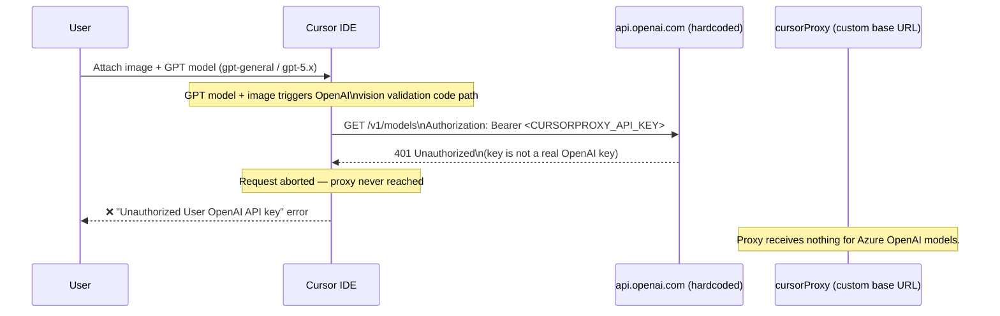
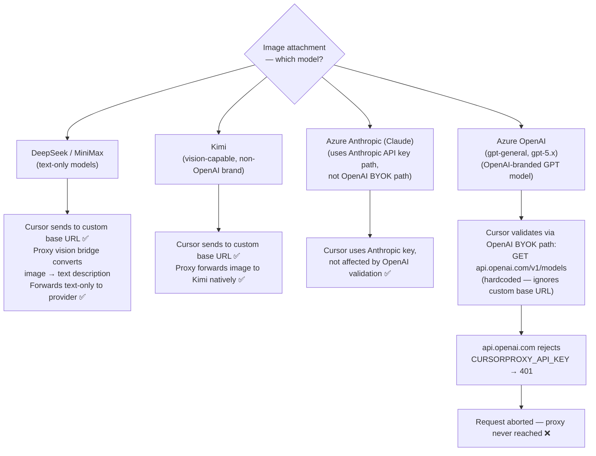

# Known Issues

Cursor-side bugs that affect cursorProxy users. These cannot be fixed in the
proxy — they require a fix from the Cursor team.

---

## Issue 1 — `gpt-general` Does Not Receive apply_patch Tools

**Status:** Open — requires Cursor fix
**Cursor bug:** https://forum.cursor.com/t/gpt-5-5-byok-not-working/160004

### Summary

When using the `gpt-general` alias, Cursor never includes the `apply_patch`
(batch apply) tool in requests — even though the underlying deployment (e.g.
`gpt-5.5`) fully supports it. The proxy handles `apply_patch` correctly; the
problem is that Cursor decides which tools to send **before** the request
reaches the proxy, based solely on the model name it sees.

### Root Cause

**Step 1 — Cursor tool selection is model-name driven**

Cursor checks the model name against an internal pattern (equivalent to the
proxy's own `isAzureReasoningModel` regex) to decide which tools to include:

```
/^(?:o\d(?:[-.]|$)|gpt-5(?:\.\d+)?(?:[-.]|$))/i
```

| Model Cursor sees | Matches pattern | apply_patch sent? |
|---|---|---|
| `cursorproxy/gpt-5.4` | ✅ yes | ✅ yes |
| `cursorproxy/gpt-general` | ❌ no (alias, not a gpt-5.x name) | ❌ never |

**Step 2 — The proxy preserves the alias name in responses**

The proxy intentionally stamps `cursorproxy/gpt-general` into every response
chunk (`proxy.js:616-618`) so the raw Azure deployment name is not leaked to
clients. Cursor always sees `gpt-general` — never the real `gpt-5.5` — and
never activates the apply_patch tool surface.

**Step 3 — The naive fix breaks proxy routing**

Returning `cursorproxy/gpt-5.5` in responses would cause Cursor to route
subsequent requests directly to OpenAI, bypassing the proxy entirely. As of
~May 4 2025, Cursor stopped routing `gpt-5.5` named models through custom base
URLs.

### Flow Comparison

```mermaid
flowchart TD
    subgraph "gpt-5.4 — works end-to-end"
        A1["Cursor sees model:\ncursorproxy/gpt-5.4"]
        A2["Pattern match ✅\n→ include apply_patch in tools"]
        A3["Request arrives at proxy\nwith apply_patch tool"]
        A4["Proxy passes apply_patch\nto Azure Responses API"]
        A5["Azure executes patch ✅"]
        A1 --> A2 --> A3 --> A4 --> A5
    end

    subgraph "gpt-general — broken at Cursor side"
        B1["Cursor sees model:\ncursorproxy/gpt-general"]
        B2["Pattern match ❌\n→ apply_patch NOT included"]
        B3["Request arrives at proxy\nwithout apply_patch tool"]
        B4["Proxy has nothing to forward ❌"]
        B1 --> B2 --> B3 --> B4
    end

    style A5 fill:#d4edda,stroke:#28a745
    style B4 fill:#f8d7da,stroke:#dc3545
```



### Why the Proxy Cannot Fix This

| Option | Problem |
|---|---|
| Return `cursorproxy/gpt-5.5` in responses | Cursor routes next request directly to OpenAI — proxy bypassed |
| Return `cursorproxy/gpt-general` (current) | Cursor never sends apply_patch |
| Inject apply_patch into every request | Cursor controls the tool list; proxy cannot add tools Cursor didn't send |

### Current Workaround

Use `cursorproxy/gpt-5.4` directly instead of `gpt-general`.

- `gpt-5.4` still routes through the custom base URL (not yet intercepted by Cursor)
- Cursor recognises it as a gpt-5.x model and includes apply_patch
- Add `gpt-5.4` to `CURSORPROXY_MODELS` alongside `gpt-general`

**Risk:** Cursor may intercept `gpt-5.4` in a future update as it did with
`gpt-5.5`. This is a temporary mitigation, not a permanent fix.

### Affected Proxy Files

| File | Role | Fixable here? |
|---|---|---|
| `api/models.js` — `withPublicResponseModel` | Forces alias name in responses | No — changing this breaks routing |
| `api/proxy.js:616-618` — `azureAliasPublicId` | Preserves alias as response model | No — same constraint |

---

## Issue 2 — Vision / Image Attachment Broken with BYOK + Custom Base URL

**Status:** Open — confirmed by Cursor staff, no ETA
**Cursor bug:** https://forum.cursor.com/t/bug-images-vision-completely-broken-with-openai-byok-custom-endpoint-override-unauthorized-error/158460
**Older duplicate:** https://forum.cursor.com/t/images-break-custom-openai-endpoint-config/116176

### Summary

When Cursor is configured with a custom OpenAI base URL (BYOK), attaching any
image to a chat fails with an `Unauthorized` / 401 error. Text-only requests
work correctly. Cursor has a separate hardcoded validation path for multimodal
requests that always calls `api.openai.com` directly, ignoring the custom base
URL entirely.

### What Happens



### Root Cause



### Impact on cursorProxy

The bug is specific to Cursor's **OpenAI BYOK validation path**, which only
fires for GPT-branded models. Azure Anthropic uses a completely separate
Anthropic API key path in Cursor. Kimi, DeepSeek, and MiniMax are not
routed through the OpenAI validation.

| Provider | Vision handling | Affected by bug? |
|---|---|---|
| DeepSeek | Proxy vision bridge converts images to text | ❌ Not affected |
| MiniMax | Proxy vision bridge converts images to text | ❌ Not affected |
| Kimi | Provider supports vision natively | ❌ Not affected — not an OpenAI-branded model |
| Azure Anthropic (Claude) | Provider supports vision natively | ❌ Not affected — uses Anthropic API key path, not OpenAI BYOK |
| Azure OpenAI (gpt-general, gpt-5.x) | Provider supports vision natively | ✅ Broken — Cursor validates via hardcoded api.openai.com → 401 |

### Workarounds

| Workaround | Works? | Notes |
|---|---|---|
| Use text-only (no image attachments) | ✅ | Only reliable option currently |
| Use Cursor's native models (non-BYOK) | ✅ | Loses proxy benefits |
| Real OpenAI key for validation | ⚠️ | Cursor may route image requests to OpenAI directly |

### Affected Proxy Files

| File | Role | Fixable here? |
|---|---|---|
| `api/vision-bridge.js` | Works correctly for DeepSeek/MiniMax; never reached for affected providers | No |
| `api/vision.js` | Vision API calls — works for DeepSeek/MiniMax | No |
| `api/proxy.js` | Request aborted before arrival for Kimi/Azure providers | No |

### Related Links

- [OpenAI BYOK chat with image throws error](https://forum.cursor.com/t/openai-byok-chat-with-image-throws-the-error/157088)
- [Proxy vision bridge doc](./vision-bridge.md)
