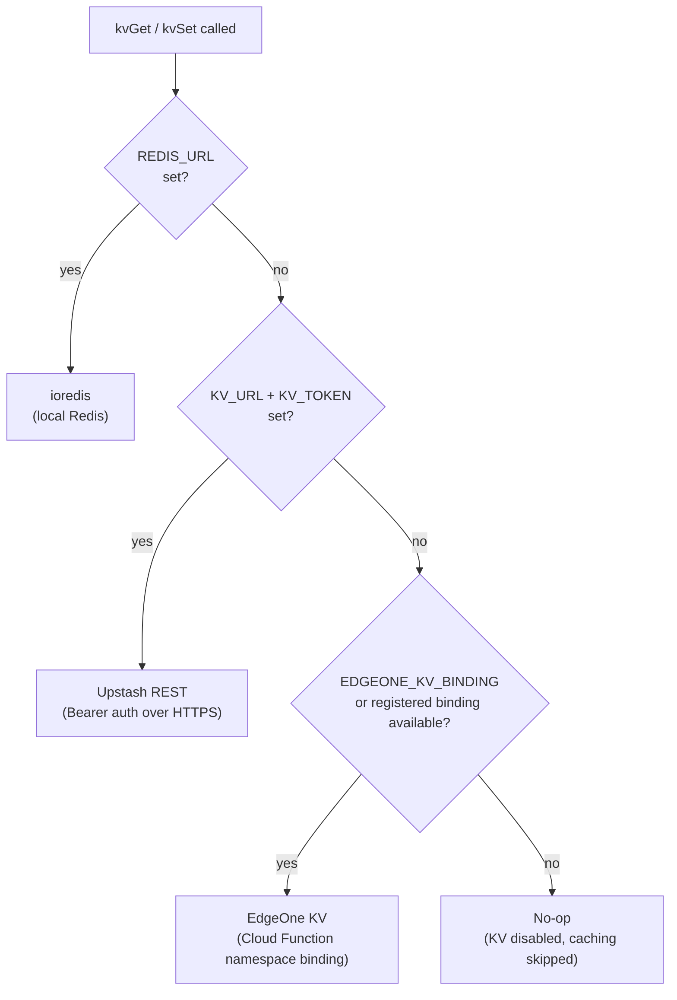
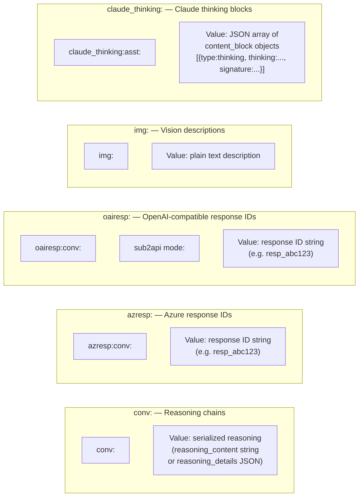
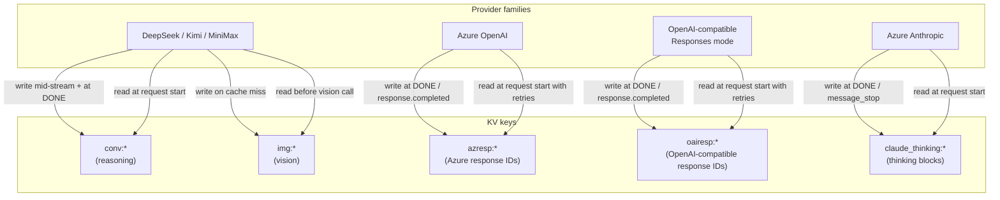
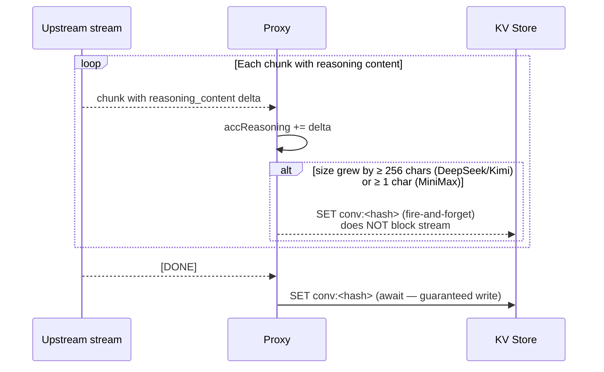
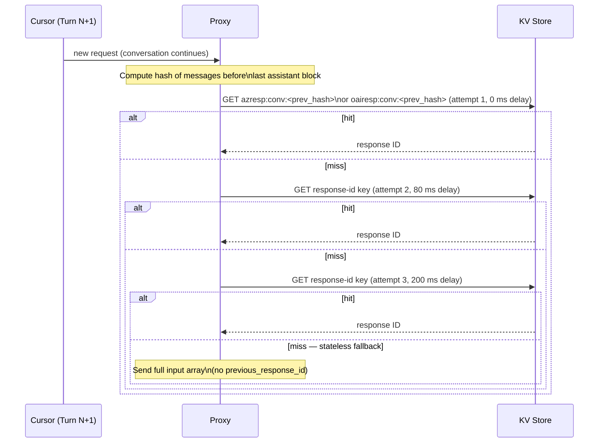
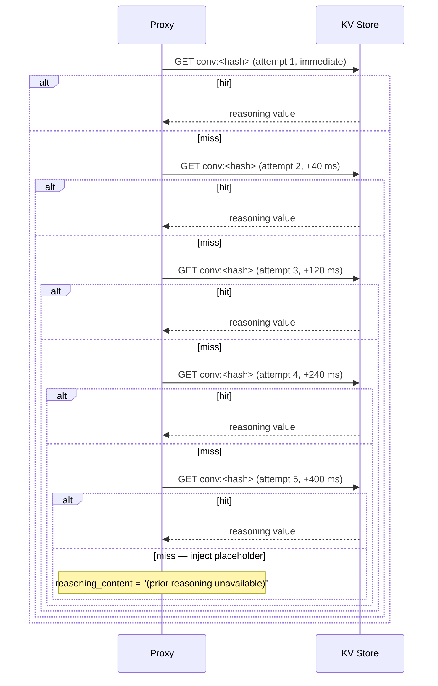
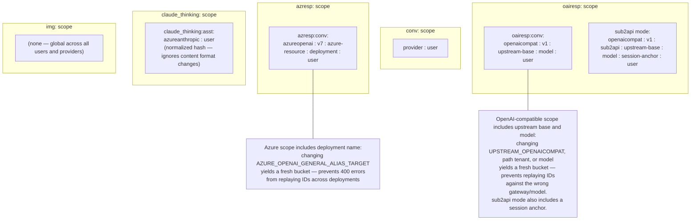

# KV Store & Caching Architecture

The proxy uses a single KV abstraction (`lib/kv.js`) that supports three
backends. All caching is stateless per-request — no shared in-process memory.

## Backend Selection

## Cache Key Types

## Who Reads and Writes Each Key

## Reasoning Snapshot Strategy (conv:)

> Mid-stream snapshots ensure that if the stream is interrupted, the next turn
> still recovers partial reasoning rather than starting from scratch.

## Retry Logic

### Response IDs (azresp: / oairesp:) — hardcoded delays

> Retries cover the race where Cursor fires a follow-up turn while the prior
> turn's `finally` block is still flushing the response ID to KV.
> Delays are hardcoded: `[0, 80, 200]` ms (total max wait ~280 ms).

For OpenAI-compatible Responses mode, `OPENAICOMPAT_CACHE_HIT_MODE=sub2api`
adds sub2api-style cache hints while keeping cursorProxy's exact-prefix KV
response-ID lookup:

- injects `prompt_cache_key=compat_cc_<hash>` for GPT-5/Codex-like models when
  the client did not send one;
- scopes `oairesp:` keys by `session_id`, then `conversation_id`, then
  `prompt_cache_key`, then a content-derived `compat_cs_<hash>` seed;
- deletes stale previous-response KV entries on `previous_response_not_found`
  and retries stateless so the successful retry can refresh the chain;
- suppresses unsupported `previous_response_id` scopes for `KV_TTL_SECONDS`.

### Reasoning (conv:) — configurable delays

> Configurable via `KV_RETRY_DELAYS_MS` (comma-separated ms, default `40,120,240,400`).
> Total max wait ~800 ms across 4 retries.

## Cache Scope Isolation

## TTL & Eviction

| Key type | Default TTL | Controlled by |
|---|---|---|
| `conv:*` | 7 200 s (2 h) | `KV_TTL_SECONDS` |
| `azresp:*` | 7 200 s (2 h) | `KV_TTL_SECONDS` |
| `oairesp:*` | 7 200 s (2 h) | `KV_TTL_SECONDS` |
| `claude_thinking:*` | 7 200 s (2 h) | `KV_TTL_SECONDS` |
| `img:*` | 604 800 s (7 d) | `KV_IMAGE_TTL_SECONDS` |

Conversation-scoped entries share `KV_TTL_SECONDS`. The image-description
cache uses its own longer TTL (`KV_IMAGE_TTL_SECONDS`, default 7 days) because
keys are content-addressed by SHA-256 of the data URI and the description is
effectively immutable — there's no reason to re-pay the vision-API cost every
2 hours. The cache version tags (`v7` in `azresp:`, `v1` in `oairesp:`) act as
logical namespace bumps — old keys are orphaned and expire naturally when the
cache version is incremented after a breaking schema change.

## Key Environment Variables

| Variable | Default | Purpose |
|---|---|---|
| `KV_TTL_SECONDS` | 7 200 | TTL for conversation-scoped keys (`conv:`, `azresp:`, `oairesp:`, `claude_thinking:`) |
| `OPENAICOMPAT_CACHE_HIT_MODE` | `default` | `sub2api` enables OpenAI-compatible Responses prompt cache key injection, session anchors, stale previous-response cleanup, and unsupported-scope TTLs |
| `KV_IMAGE_TTL_SECONDS` | 604 800 (7 d) | TTL for `img:*` description cache |
| `KV_FETCH_TIMEOUT_MS` | inherits `UPSTREAM_CONNECT_TIMEOUT_MS`, then 8 000 | Upstash REST request timeout; covers connect AND body read |
| `KV_RETRY_DELAYS_MS` | `40,120,240,400` | Reasoning KV read retry delays (ms, comma-separated) |
| `REDIS_URL` | — | Local Redis connection string (Docker) |
| `KV_URL` | — | Upstash Redis REST endpoint (Vercel) |
| `KV_TOKEN` | — | Upstash Redis Bearer token (Vercel) |
| `EDGEONE_KV_BINDING` | — | EdgeOne KV namespace binding name |
