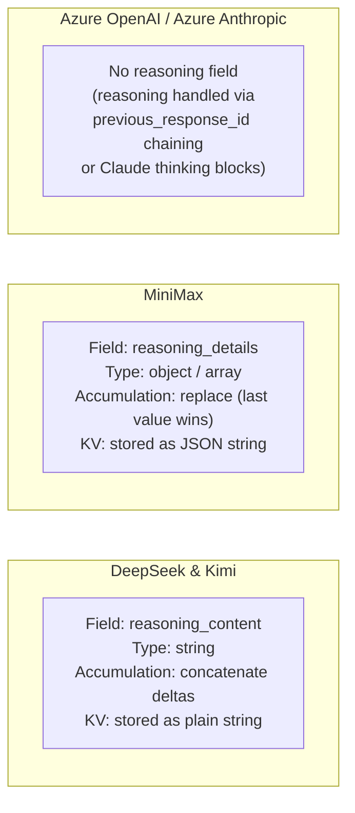
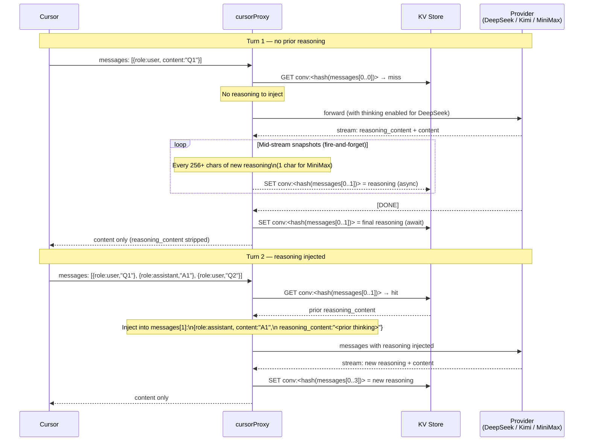
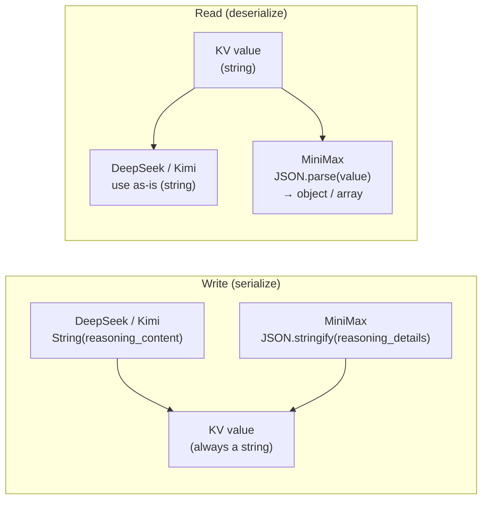
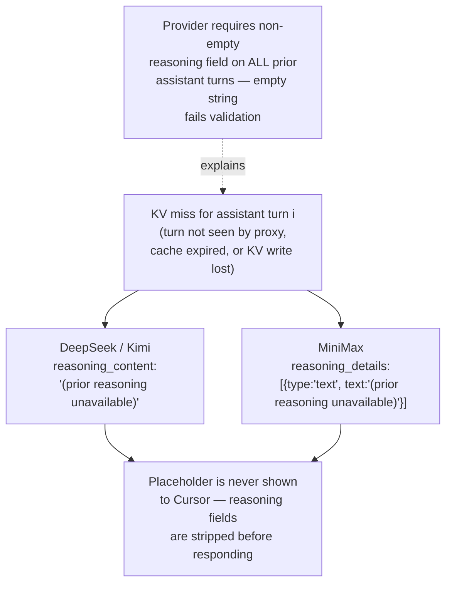
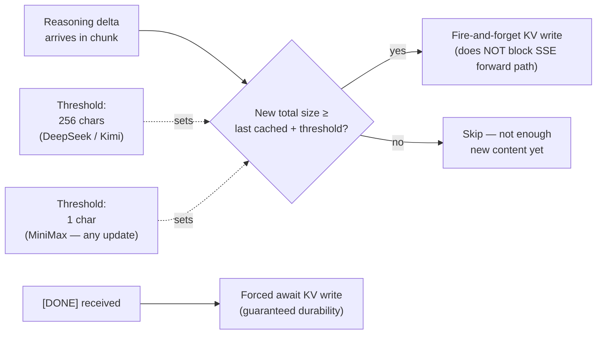

# Reasoning Bridge

DeepSeek, Kimi, and MiniMax are reasoning models that expose their chain-of-thought
as a sibling field alongside the answer. The proxy caches this field after each turn
and injects it back into prior assistant messages on subsequent turns — satisfying
the providers' requirement that every prior assistant turn carry its original reasoning.

## Provider Differences



## Multi-turn Reasoning Flow



## Reasoning Accumulation: DeepSeek/Kimi vs MiniMax

```mermaid
flowchart TD
    subgraph "DeepSeek / Kimi — concatenate"
        DC1["chunk 1: delta = 'First part'"]
        DC2["chunk 2: delta = ' of reasoning'"]
        DC3["chunk 3: delta = ' continues'"]
        DACC["accReasoning = 'First part of reasoning continues'"]
        DC1 --> DC2 --> DC3 --> DACC
    end

    subgraph "MiniMax — replace (last value wins)"
        MC1["chunk 1: reasoning_details = {summary:'v1'}"]
        MC2["chunk 2: reasoning_details = {summary:'v2'}"]
        MC3["chunk 3: reasoning_details = {summary:'final'}"]
        MACC["accReasoning = {summary:'final'}"]
        MC1 --> MC2 --> MC3 --> MACC
    end
```



> MiniMax sends the complete `reasoning_details` object on each delta, not
> incremental patches. Storing the last-seen value is correct.

## KV Serialization



## Placeholder Injection (Cache Miss)



## Snapshot Write Strategy



> Mid-stream snapshots protect against interrupted streams: if the connection
> drops before `[DONE]`, the next turn still recovers most of the reasoning.

## Reasoning Retry on Injection

When loading prior reasoning at the start of a request, the proxy retries
the KV read to handle the race where the prior turn's stream just finished
and the final write hasn't landed yet.

```
Retry delays (KV_RETRY_DELAYS_MS, default): 40 ms → 120 ms → 240 ms → 400 ms
Max attempts: 5 (1 immediate + 4 retries)
Total max wait: ~800 ms
On all misses: inject placeholder text
```

## Key Environment Variables

| Variable | Default | Purpose |
|---|---|---|
| `KV_RETRY_DELAYS_MS` | `40,120,240,400` | Reasoning KV retry delays (ms, comma-separated) |
| `KV_TTL_SECONDS` | 7 200 | Cache TTL for all reasoning entries |
| `DEEPSEEK_REASONING_EFFORT` | `high` | DeepSeek thinking effort (`high` or `max`) |
