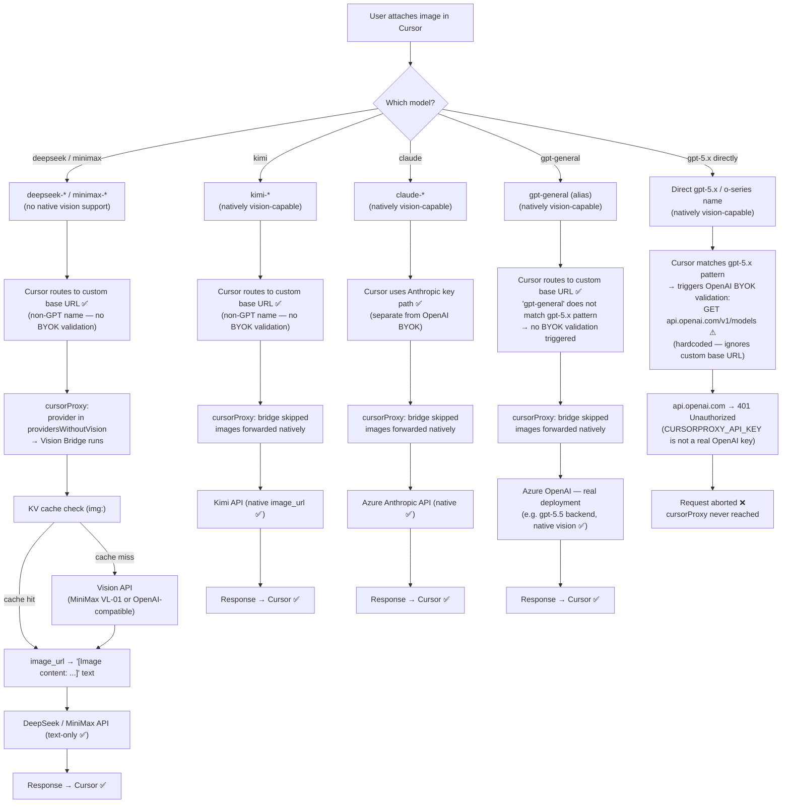
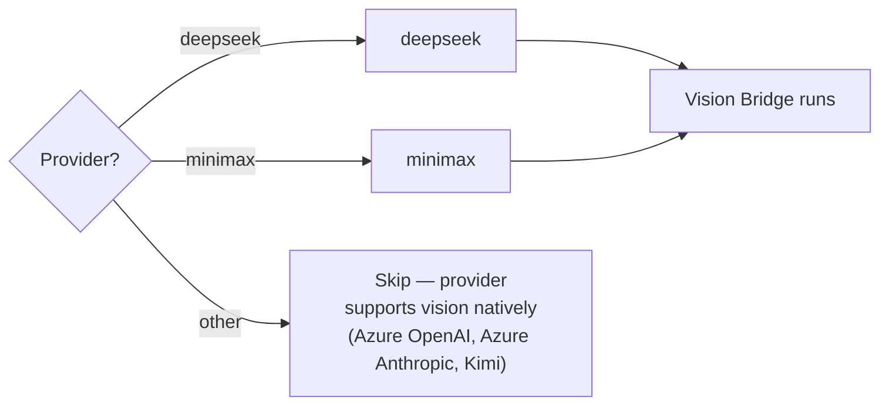
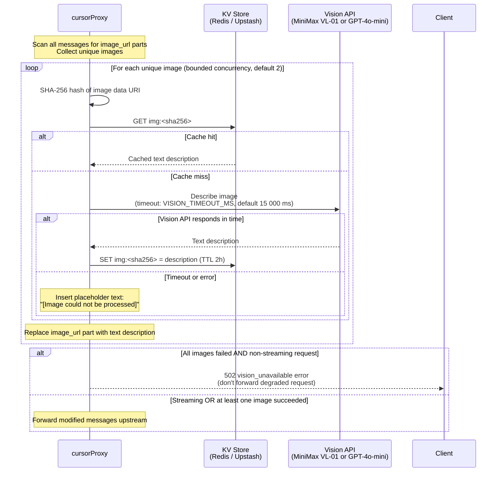
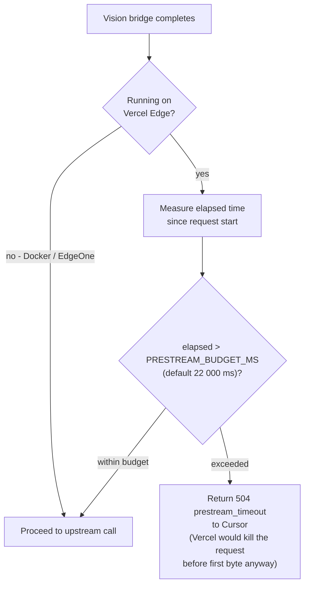
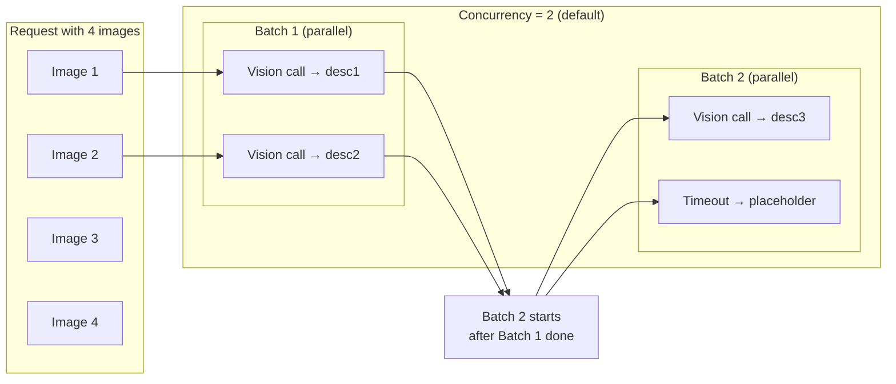
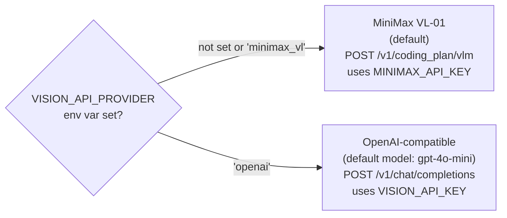

# Vision Bridge

## Cursor ↔ cursorProxy Vision Collaboration

All five provider paths work with images except one: directly named GPT-5 / o-series
models on affected Cursor builds (for example `gpt-5.4` or `gpt-5.5`). The
`gpt-general` alias is vision-capable and works end-to-end because Cursor never
matches the alias name against the GPT-5.x pattern that triggers its BYOK
validation.

The proxy vision bridge only applies to DeepSeek and MiniMax (text-only
providers). All other providers — including `gpt-general` — receive images
natively.



| Model | Native vision? | Proxy vision bridge? | Cursor routing | End-to-end result |
|---|---|---|---|---|
| DeepSeek / MiniMax | ❌ No | ✅ Yes — image → text | Custom base URL (direct) | ✅ Works via bridge |
| Kimi | ✅ Yes | ❌ No | Custom base URL (direct) | ✅ Works natively |
| Azure Anthropic (Claude) | ✅ Yes | ❌ No | Anthropic key path | ✅ Works natively |
| `gpt-general` (alias) | ✅ Yes | ❌ No | Custom base URL — alias name skips BYOK validation | ✅ Works natively |
| Direct `gpt-5.x` / o-series name | ✅ Yes | ❌ No — proxy never reached | BYOK validation → `api.openai.com` → **401** | ❌ Broken — Cursor bug |

> The BYOK validation fires because Cursor matches the literal model name against a `gpt-5.x`
> pattern. Using the `gpt-general` alias avoids the match, so images work. The same pattern
> check also controls `apply_patch` tool inclusion — see `known-issues.md` for the trade-off
> between the two model configurations.

---

## Vision Bridge Detail (DeepSeek / MiniMax only)

Providers that only accept text (DeepSeek, MiniMax chat endpoint) cannot handle
`image_url` content parts. The vision bridge intercepts those messages, describes
every image via a vision-capable API, and replaces the image parts with text
before the request is forwarded.

## When the Bridge Activates



## Full Vision Bridge Flow



## Vercel Pre-stream Budget Guard



## Concurrency & Timeout Model



## Vision API Selection



## Cache Key Structure

```
img:<sha256-of-image-data-uri>
│
├── Value: plain text description
└── TTL:   KV_TTL_SECONDS (default 7200 s / 2 h)
```

The same image sent in different conversations or by different users hits the
same cache key — image content is provider-agnostic and user-agnostic.

## Key Environment Variables

| Variable | Default | Purpose |
|---|---|---|
| `VISION_API_PROVIDER` | `minimax_vl` | Backend: `minimax_vl` or `openai` |
| `VISION_API_URL` | (provider default) | Override vision endpoint URL |
| `VISION_MODEL` | `MiniMax-VL-01` / `gpt-4o-mini` | Override vision model name |
| `VISION_TIMEOUT_MS` | 15 000 | Per-image call timeout (0 = disabled) |
| `VISION_CONCURRENCY` | 2 | Max parallel vision calls |
| `PRESTREAM_BUDGET_MS` | 22 000 | Vercel pre-stream wall time |
| `MINIMAX_API_KEY` | — | Used when `VISION_API_PROVIDER=minimax_vl` |
| `VISION_API_KEY` | — | Used when `VISION_API_PROVIDER=openai` |
