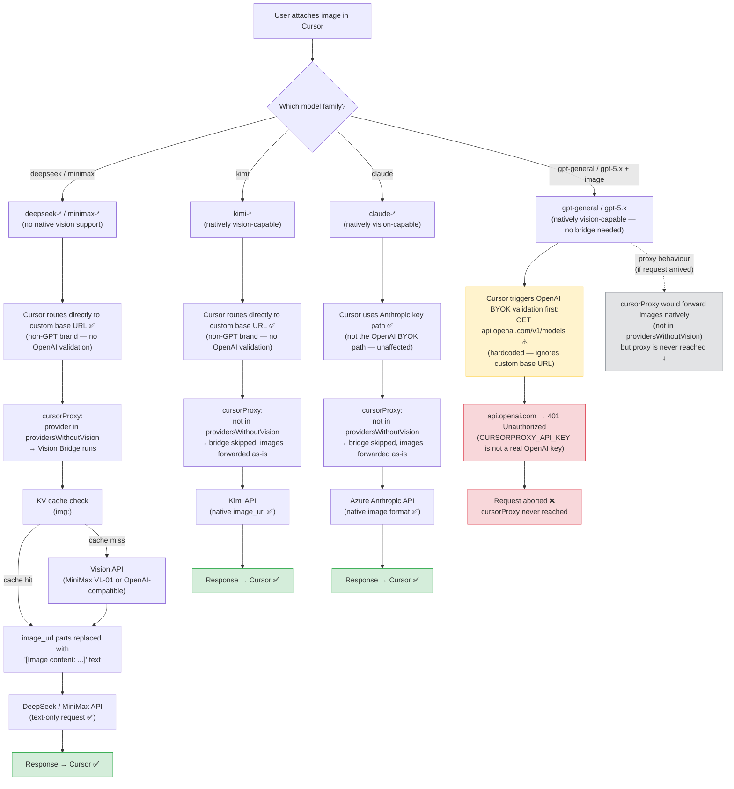
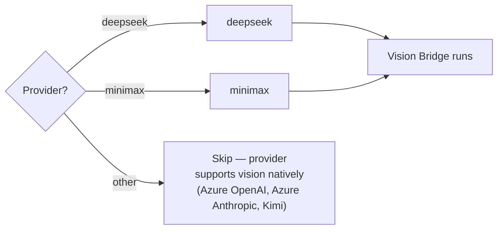
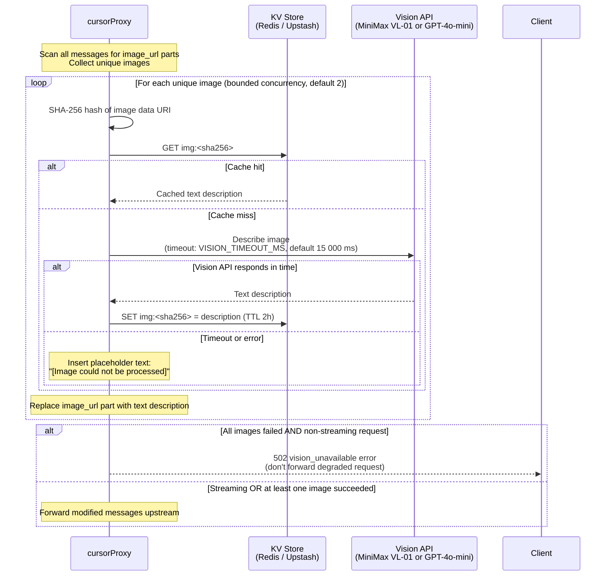
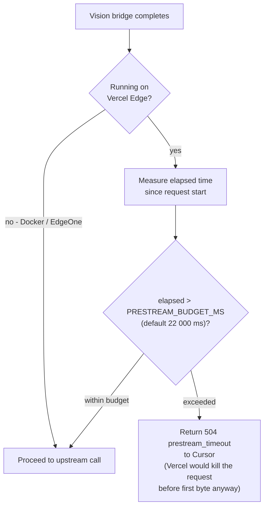
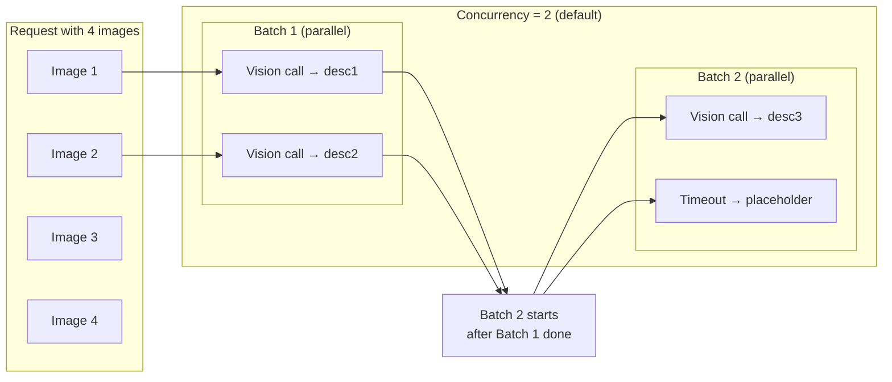
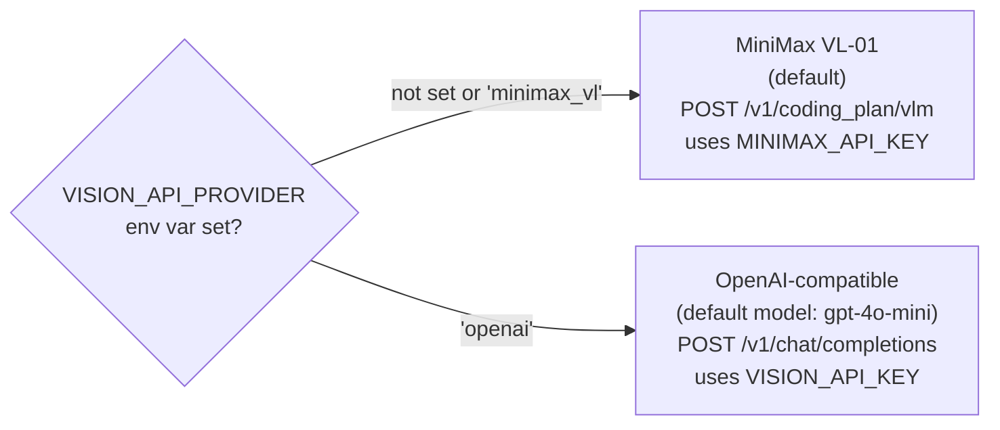

# Vision Bridge

## Cursor ↔ cursorProxy Vision Collaboration

Three of the four provider families work with images. The proxy applies its
vision bridge only for DeepSeek and MiniMax (text-only providers). Kimi, Claude,
and Azure OpenAI are all natively vision-capable — the proxy passes images
straight through for all three. The Azure OpenAI path is broken not by the
proxy but by a Cursor-side BYOK routing bug that aborts the request before it
arrives.



| Provider | Native vision? | Proxy vision bridge? | Cursor routing | End-to-end result |
|---|---|---|---|---|
| DeepSeek / MiniMax | ❌ No | ✅ Yes — image → text via vision API | Custom base URL (direct) | ✅ Works via bridge |
| Kimi | ✅ Yes | ❌ No — images forwarded as-is | Custom base URL (direct) | ✅ Works natively |
| Azure Anthropic (Claude) | ✅ Yes | ❌ No — images forwarded as-is | Anthropic key path (separate) | ✅ Works natively |
| Azure OpenAI (gpt-general, gpt-5.x) | ✅ Yes | ❌ No — proxy never reached | OpenAI BYOK validation → `api.openai.com` → **401** | ❌ Broken — Cursor bug |

> Azure OpenAI natively supports vision and the proxy would forward images without any bridge — the failure is entirely in Cursor's routing layer. See `known-issues.md` Issue 2 for details and workarounds.

---

## Vision Bridge Detail (DeepSeek / MiniMax only)

Providers that only accept text (DeepSeek, MiniMax chat endpoint) cannot handle
`image_url` content parts. The vision bridge intercepts those messages, describes
every image via a vision-capable API, and replaces the image parts with text
before the request is forwarded.

## When the Bridge Activates



## Full Vision Bridge Flow



## Vercel Pre-stream Budget Guard



## Concurrency & Timeout Model



## Vision API Selection



## Cache Key Structure

```
img:<sha256-of-image-data-uri>
│
├── Value: plain text description
└── TTL:   KV_TTL_SECONDS (default 7200 s / 2 h)
```

The same image sent in different conversations or by different users hits the
same cache key — image content is provider-agnostic and user-agnostic.

## Key Environment Variables

| Variable | Default | Purpose |
|---|---|---|
| `VISION_API_PROVIDER` | `minimax_vl` | Backend: `minimax_vl` or `openai` |
| `VISION_API_URL` | (provider default) | Override vision endpoint URL |
| `VISION_MODEL` | `MiniMax-VL-01` / `gpt-4o-mini` | Override vision model name |
| `VISION_TIMEOUT_MS` | 15 000 | Per-image call timeout (0 = disabled) |
| `VISION_CONCURRENCY` | 2 | Max parallel vision calls |
| `PRESTREAM_BUDGET_MS` | 22 000 | Vercel pre-stream wall time |
| `MINIMAX_API_KEY` | — | Used when `VISION_API_PROVIDER=minimax_vl` |
| `VISION_API_KEY` | — | Used when `VISION_API_PROVIDER=openai` |
