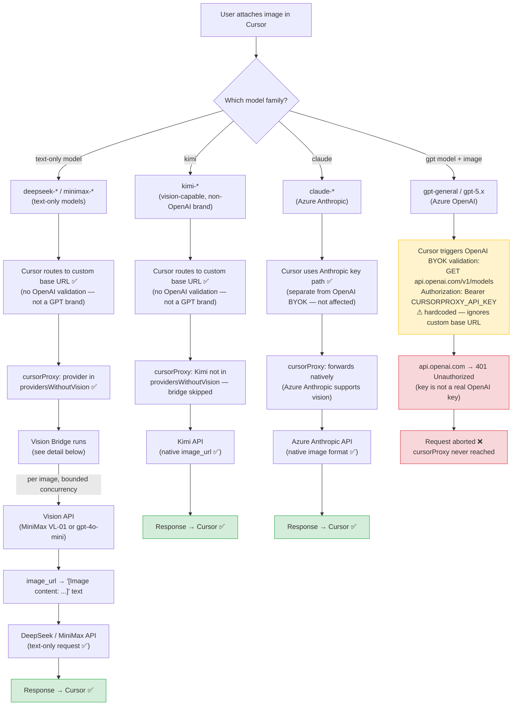
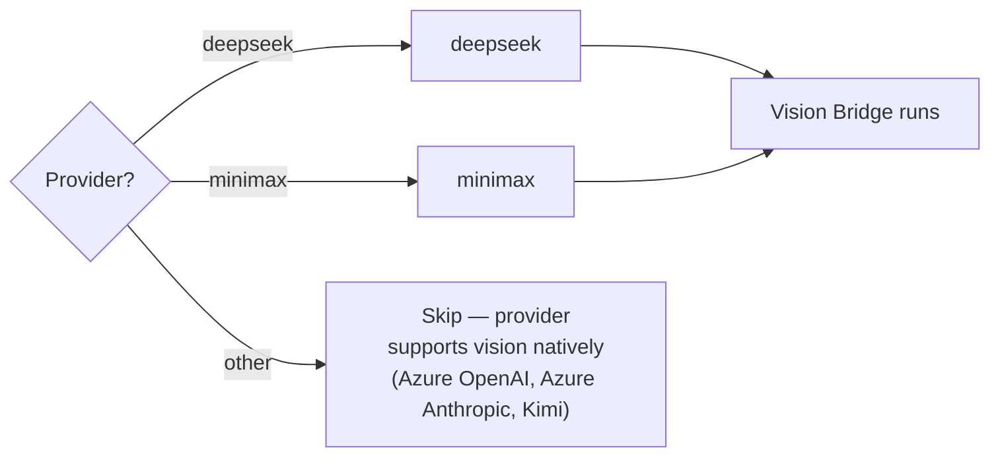
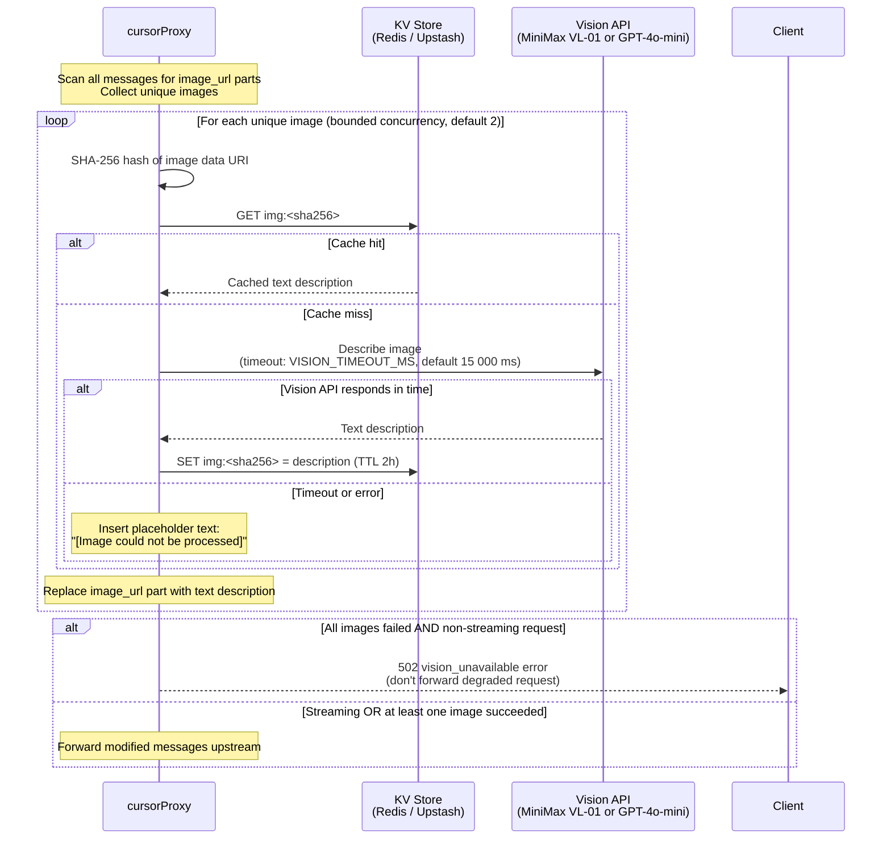
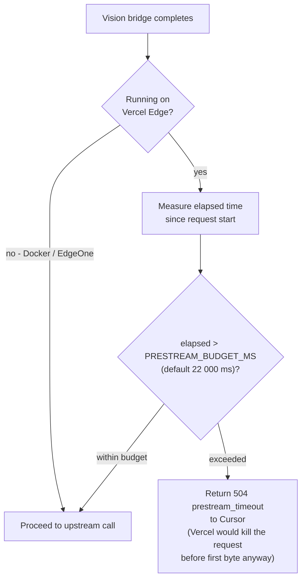
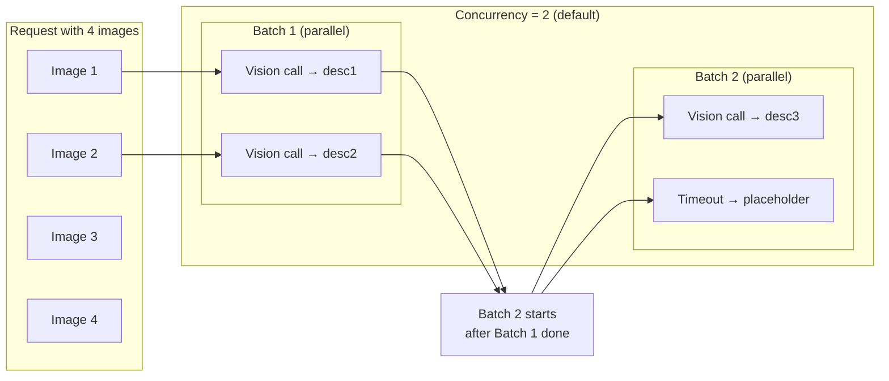
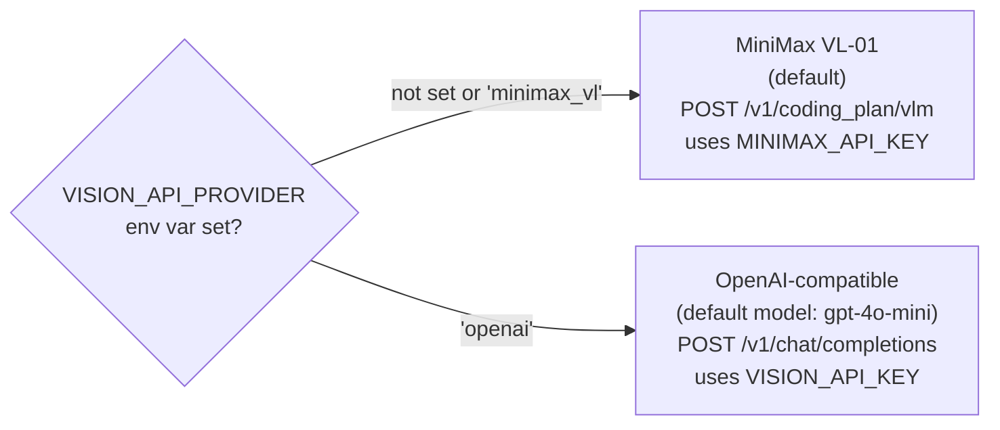

# Vision Bridge

## Cursor ↔ cursorProxy Vision Collaboration

The four provider families take completely different paths when an image is
attached. Cursor's routing decision happens **before** the request reaches the
proxy, based solely on the model name.



| Provider | Cursor routing | Proxy action | Works with images? |
|---|---|---|---|
| DeepSeek / MiniMax | Custom base URL (no OpenAI validation) | Vision bridge: image → text description | ✅ Yes — via bridge |
| Kimi | Custom base URL (no OpenAI validation) | Pass through natively | ✅ Yes — native |
| Azure Anthropic (Claude) | Anthropic key path (separate from OpenAI BYOK) | Pass through natively | ✅ Yes — native |
| Azure OpenAI (gpt-general, gpt-5.x) | OpenAI BYOK validation fires first → hardcoded `api.openai.com` → **401** | Never reached | ❌ Broken (Cursor bug) |

> The Azure OpenAI image failure is a Cursor-side bug — see `known-issues.md` Issue 2 for details and workarounds.

---

## Vision Bridge Detail (DeepSeek / MiniMax only)

Providers that only accept text (DeepSeek, MiniMax chat endpoint) cannot handle
`image_url` content parts. The vision bridge intercepts those messages, describes
every image via a vision-capable API, and replaces the image parts with text
before the request is forwarded.

## When the Bridge Activates



## Full Vision Bridge Flow



## Vercel Pre-stream Budget Guard



## Concurrency & Timeout Model



## Vision API Selection



## Cache Key Structure

```
img:<sha256-of-image-data-uri>
│
├── Value: plain text description
└── TTL:   KV_TTL_SECONDS (default 7200 s / 2 h)
```

The same image sent in different conversations or by different users hits the
same cache key — image content is provider-agnostic and user-agnostic.

## Key Environment Variables

| Variable | Default | Purpose |
|---|---|---|
| `VISION_API_PROVIDER` | `minimax_vl` | Backend: `minimax_vl` or `openai` |
| `VISION_API_URL` | (provider default) | Override vision endpoint URL |
| `VISION_MODEL` | `MiniMax-VL-01` / `gpt-4o-mini` | Override vision model name |
| `VISION_TIMEOUT_MS` | 15 000 | Per-image call timeout (0 = disabled) |
| `VISION_CONCURRENCY` | 2 | Max parallel vision calls |
| `PRESTREAM_BUDGET_MS` | 22 000 | Vercel pre-stream wall time |
| `MINIMAX_API_KEY` | — | Used when `VISION_API_PROVIDER=minimax_vl` |
| `VISION_API_KEY` | — | Used when `VISION_API_PROVIDER=openai` |
